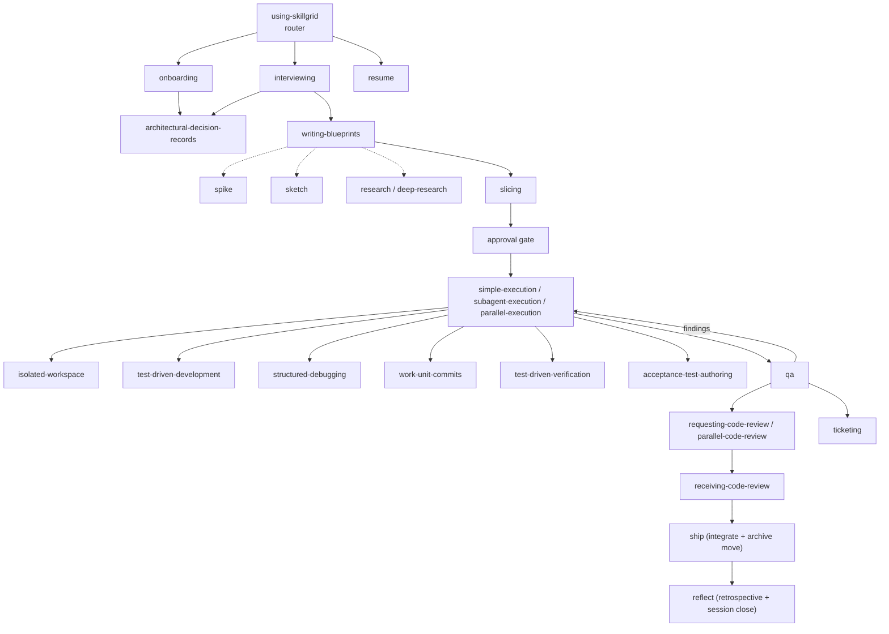

# Workflow usage

Day-to-day Spec-Driven Development with AISkillGrid.

## Quick path

1. Start (or resume) a session in a project that has `.skillgrid/config.yaml`.
2. Ask the agent to use **`using-skillgrid`** for the work you want.
3. Follow the phase it announces. After the **blueprint/slice**, approve before execution.

```
onboarding → interviewing → writing-blueprints → slicing → [approval gate] → apply ⇄ qa → ticketing
              ↑                    ↑
        optional spike / sketch / research / deep-research
```

## Entry: `using-skillgrid`

The entry skill only **routes**. It does not write `blueprint.md` / `tasks.md` / product code.

| Your request | Route |
|--------------|-------|
| Uninitialized repo | `onboarding` → confirm facts → stop for validation |
| Feature / bug / refactor / greenfield | optional `spike` / `sketch` / `research` → `interviewing` → `writing-blueprints` → `slicing` → **approval gate** |
| Q&A / lookup | `mnemonic` / code index / `research` (no pipeline) |
| Spike only | `spike` (promote to blueprint if you keep findings) |
| Mid-change | `resume` from `checkpoint.json` / `state.md` |

Announce pattern: `Using <skill> to <route>`.

## Phases

| Phase | Skill | You get |
|-------|--------|---------|
| Onboard | `onboarding` | `.skillgrid/config.yaml`, glossary stubs, `AGENTS.md` block |
| Interview | `interviewing` | Resolved ambiguity; terms recorded into glossary/ADRs |
| Blueprint | `writing-blueprints` | `blueprint.md` (Must-Haves, one-way-door tags) |
| Slice | `slicing` | `tasks.md` (tracer-bullet tickets, dependency edges, execution waves) |
| **Approval gate** | — | **Go** or **Revise** — never skip |
| Apply | `simple-execution` / `subagent-execution` / `parallel-execution` | Unblocked slices executed; TDD per task; commits via `work-unit-commits` |
| QA | `qa` | 4-state gate (PASS / CONCERNS / FAIL / WAIVED) + human QA plan; findings → apply |
| Publish | `ticketing` | Tickets pushed to the tracker; status machine advances |

## Skill triggers (who calls who)



Cross-cutting skills (`mnemonic`, `ponytail`) are available at every stage.

## Artifacts

```text
.skillgrid/
├── config.yaml
    ├── sdd/
    │   ├── checkpoint.json        # derived resume handle
    │   └── gate-stop-state.json   # Stop-hook loop guard
    ├── specs/
    │   └── acceptance.feature     # BDD (spec zone) — ACTIVE changes
    └── archive/                   # CLOSED changes (immutable), created by ship
        └── YYYY-MM-DD-<topic>/    #   + retrospective.md + archive-report.md (reflect)
```

Blueprint (`blueprint.md`), slices (`tasks.md`), glossary/ADRs, and the ticket set live in the repo per the tracker config. Numbering: slice `NN-name`; gate `G<n>`. Never reuse or renumber after creation.

## Resume map

| Durable state present | Action |
|-----------------------|--------|
| No `.skillgrid/config.yaml` | `onboarding` |
| `blueprint.md` not final | `interviewing` / `writing-blueprints` (spike/sketch first if needed) |
| `tasks.md` incomplete | `slicing` → approval gate |
| Mid-apply | `resume` from `checkpoint.json`; continue unblocked slices |
| QA FAIL / CONCERNS | `qa` findings → `apply` again |
| QA PASS/WAIVED | `ticketing` → advance status |
| Review clean, not shipped | `ship` (integrate to base + move folder to `archive/`) |
| `ship-report.md` present, no `retrospective.md` | `reflect` (terminal) |
| `retrospective.md` present | none — cycle complete |

## Apply ⇄ QA loop

1. Agent runs TDD and traces to acceptance scenarios.
2. Agent runs the `#### Gates` oracles (`test-driven-verification` / `gate-state.sh --reverify`).
3. Code review as needed (`requesting-code-review` / `parallel-code-review` / `receiving-code-review`).
4. Your QA or review findings become new slices → **apply** again.
5. QA gate PASS/WAIVED, no open slices, human QA accepted or waived → **ticketing**.

## Close-out (ship → reflect)

Once review is clean, the change is closed in two steps:

1. **`ship`** — verify tests are green on the *integrated* tree, then integrate to the base branch (merge / PR / keep — the user decides), and **mechanically move** the change folder `specs/YYYY-MM-DD-<topic>/` → `archive/YYYY-MM-DD-<topic>/` (shell `git mv` + `diff -r` readback). Writes `ship-report.md`. No release mechanics, no docs check.
2. **`reflect`** (terminal) — read-only over the archived folder: a sourced retrospective (Decisions / Lessons / Patterns / Surprises) + an acceptance verdict (advisory: `accepted` / `accepted-with-open-items` / `rejected`), a final-state `archive-report.md` with observation-ID lineage, and the Mnemonic session close.

`specs/` holds only *active* changes; a folder in `archive/` is closed and is never resumed.

## Vertical slices and context

- Prefer thin end-to-end slices over "all DB then all API then all UI".
- Keep the orchestrator in the **smart zone** (~≤ 40% context): route and point; delegate heavy work to subagents and Mnemonic ([multi-agent](06-multi-agent-work.md), [memory](05-memory-and-indexing.md)).

## Checklist

- [ ] Initialized (`.skillgrid/config.yaml`)
- [ ] Blueprint + slices complete → approval gate before apply
- [ ] Gates freshly run + human QA before ticketing
- [ ] Context still in the smart zone; checkpoint to Mnemonic if heavy

## Next step

[Hooks](04-hooks.md) — how discipline is enforced, not just asked. For the full definitions of the moving parts (clarity gate, waves, QA gate, goal-backward, traceability), see [Concepts](08-concepts.md).
