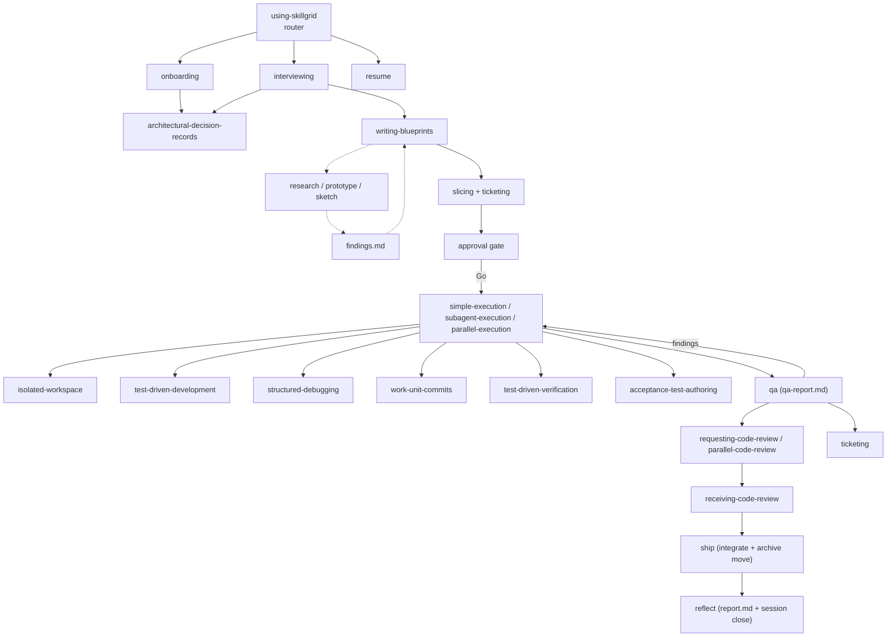

# Workflow usage

Day-to-day Spec-Driven Development with AISkillGrid.

## Quick path

1. Start (or resume) a session in a project that has `.skillgrid/config.yaml`.
2. Ask the agent to use **`using-skillgrid`** for the work you want.
3. Follow the phase it announces. After the **blueprint/slice**, approve before execution.

```
onboarding → interviewing → writing-blueprints → slicing → [approval gate] → apply ⇄ qa → ticketing
              ↑                    ↑
        optional prototype / sketch / research / code-research
```

## Entry: `using-skillgrid`

The entry skill only **routes**. It does not write `blueprint.md` / `tasks.md` / product code.

| Your request | Route |
|--------------|-------|
| Uninitialized repo | `onboarding` → confirm facts → stop for validation |
| Feature / bug / refactor / greenfield | optional `prototype` / `sketch` / `research` → `interviewing` → `writing-blueprints` → `slicing` → **approval gate** |
| Q&A / lookup | `mnemonic` / code index / `research` (no pipeline) |
| Prototype only | `prototype` (promote to blueprint if you keep findings) |
| Mid-change | `resume` from `checkpoint.json` (+ spec-zone artifacts for the phase) |

Announce pattern: `Using <skill> to <route>`.

## Phases

| Phase | Skill | You get |
|-------|--------|---------|
| Onboard | `onboarding` | `.skillgrid/config.yaml`, glossary stubs, `AGENTS.md` block |
| Interview | `interviewing` | Resolved ambiguity; terms recorded into glossary/ADRs |
| Blueprint | `writing-blueprints` | `blueprint.md` (Must-Haves, one-way-door tags) |
| Slice | `slicing` | `tasks.md` (tracer-bullet tickets, dependency edges, execution waves) |
| **Approval gate** | — | **Go** or **Revise** — never skip |
| Apply | `simple-execution` / `subagent-execution` / `parallel-execution` | Unblocked slices executed; TDD per task; commits via `work-unit-commits` |
| QA | `qa` | 4-state gate (PASS / CONCERNS / FAIL / WAIVED) + human QA plan; drift guards (state, structure, byte-budget); findings → apply |
| Publish | `ticketing` | Tickets pushed to the tracker; status machine advances |

## Skill triggers (who calls who)


```mermaid
flowchart TD
    entry["using-skillgrid<br/>router"] --> onboard["onboarding"]
    entry --> interview["interviewing"]
    entry --> resume["resume"]

    onboard --> adr["architectural-decision-records"]

    interview --> adr
    interview --> blueprint["writing-blueprints"]

    blueprint -.-> research["research / prototype / sketch"]
    research -.-> findings["findings.md"]
    findings -.-> blueprint

    blueprint --> slicing["slicing + ticketing"]
    slicing --> gate["approval gate"]

    gate -->|Go| apply["simple-execution / subagent-execution / parallel-execution"]
    apply --> isolated["isolated-workspace"]
    apply --> tdd["test-driven-development"]
    apply --> debug["structured-debugging"]
    apply --> workunits["work-unit-commits"]
    apply --> tddverif["test-driven-verification"]
    apply --> accept["acceptance-test-authoring"]

    apply --> qa["qa (qa-report.md)"]
    qa --> reqreview["requesting-code-review / parallel-code-review"]
    reqreview --> reception["receiving-code-review"]
    reception --> ship["ship (integrate + archive move)"]
    ship --> reflect["reflect (report.md + session close)"]
    qa -->|findings| apply
    qa --> ticket["ticketing"]
```

Cross-cutting skills (`mnemonic`, `ponytail`) are available at every stage.

## Artifacts

```text
.skillgrid/
├── config.yaml
├── sdd/
│   ├── checkpoint.json        # derived resume handle (from the last commit's [skillgrid-context])
│   └── gate-stop-state.json   # Stop-hook loop guard
├── specs/YYYY-MM-DD-<topic>/  # ACTIVE changes (spec zone, committed)
│   ├── briefing.md
│   ├── acceptance.feature     # BDD (traceability oracle)
│   ├── adr.md                 # ADR Review Manifest
│   ├── findings.md            # research / prototype / sketch evidence (optional)
│   ├── blueprint.md
│   ├── tasks.md               # tickets, waves, dependencies
│   └── qa-report.md           # test plan + 4-state gate + evidence
└── archive/                   # CLOSED changes (immutable), created by ship
    └── YYYY-MM-DD-<topic>/    #   + report.md (reflect: integration + retro + lineage)
```

Blueprint (`blueprint.md`), slices (`tasks.md`), glossary/ADRs, and the ticket set live in the repo per the tracker config. Numbering: slice `NN-name`; gate `G<n>`. Never reuse or renumber after creation.

## Resume map

| Durable state present | Action |
|-----------------------|--------|
| No `.skillgrid/config.yaml` | `onboarding` |
| `blueprint.md` not final | `interviewing` / `writing-blueprints` (prototype/sketch first if needed) |
| `tasks.md` incomplete | `slicing` → approval gate |
| Mid-apply | `resume` from `checkpoint.json`; continue unblocked slices |
| QA FAIL / CONCERNS | `qa` findings → `apply` again |
| QA PASS/WAIVED | `ticketing` → advance status |
| Review clean, not shipped | `ship` (integrate to base + move folder to `archive/`) |
| Folder in `archive/`, no `report.md` | `reflect` (terminal) |
| `report.md` present in `archive/` | none — cycle complete |

## Apply ⇄ QA loop

1. Agent runs TDD and traces to acceptance scenarios.
2. Agent runs the `#### Gates` oracles (`test-driven-verification` / `gate-state.js --reverify`).
3. Code review as needed (`requesting-code-review` / `parallel-code-review` / `receiving-code-review`).
4. Your QA or review findings become new slices → **apply** again.
5. QA gate PASS/WAIVED, no open slices, human QA accepted or waived → **ticketing**.

## Structural guards (qa)

Three advisory checks run at QA (Steps 9.5–9.6) before the gate renders. All
are WARNING-only — they never affect the four-state verdict:

- **State drift** (`state-drift-check.mjs`) — compares `state.yaml` against
  the spec-zone artifacts. Catches a pipeline skill that forgot to update
  `state.yaml` at a phase transition.
- **Structure drift** (`ship-drift-check.mjs`) — diffs `base..HEAD` against
  the anticipated file set (`tasks.md` Files + `blueprint.md` Global
  Constraints). Catches scope creep before integration.
- **Byte budget** (`skill-size-budget.mjs`) — checks SKILL.md sizes against
  per-tier ceilings. Catches unbounded skill-file growth.

## Close-out (ship → reflect)

Once review is clean, the change is closed in two steps:

1. **`ship`** — verify tests are green on the *integrated* tree, then integrate to the base branch (merge / PR / keep — the user decides), and **mechanically move** the change folder `specs/YYYY-MM-DD-<topic>/` → `archive/YYYY-MM-DD-<topic>/` (shell `git mv` + `diff -r` readback). Writes no report file — it captures the ship context in its Return Envelope. No release mechanics, no docs check.
2. **`reflect`** (terminal) — read-only over the archived folder: writes the single `report.md` (final-state facts, gate results, sourced Decisions / Lessons / Patterns / Surprises, an advisory acceptance verdict `accepted` / `accepted-with-open-items` / `rejected`, move evidence, observation-ID lineage), then the Mnemonic session close.

`specs/` holds only *active* changes; a folder in `archive/` is closed and is never resumed.

## Vertical slices and context

- Prefer thin end-to-end slices over "all DB then all API then all UI".
- Keep the orchestrator in the **smart zone** (~≤ 40% context): route and point; delegate heavy work to subagents and Mnemonic ([multi-agent](06-multi-agent-work.md), [memory](05-memory-and-indexing.md)).

## Checklist

- [ ] Initialized (`.skillgrid/config.yaml`)
- [ ] Blueprint + slices complete → approval gate before apply
- [ ] Gates freshly run + human QA before ticketing
- [ ] Context still in the smart zone; checkpoint to Mnemonic if heavy

## Next step

[Hooks](04-hooks.md) — how discipline is enforced, not just asked. For the full definitions of the moving parts (clarity gate, waves, QA gate, goal-backward, traceability), see [Guiding Principles](08-guiding-principles.md).
