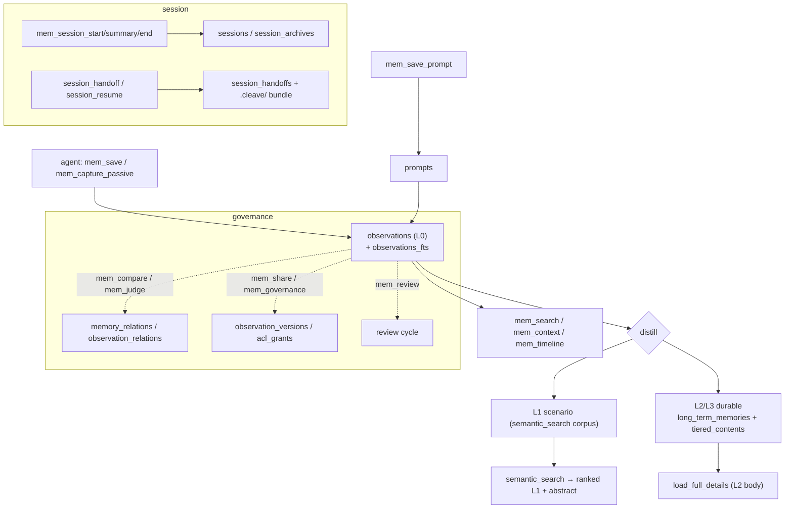
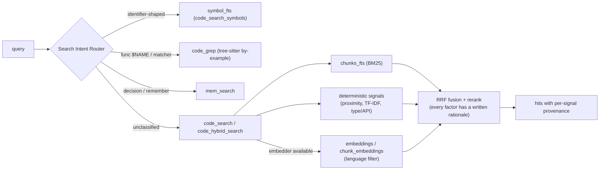
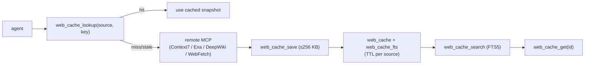
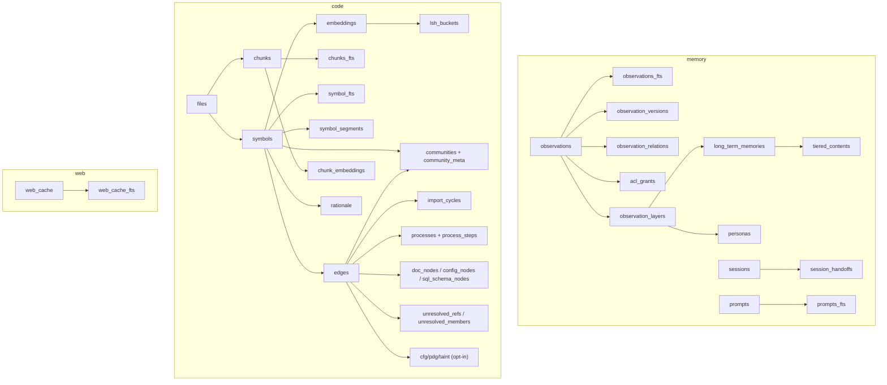
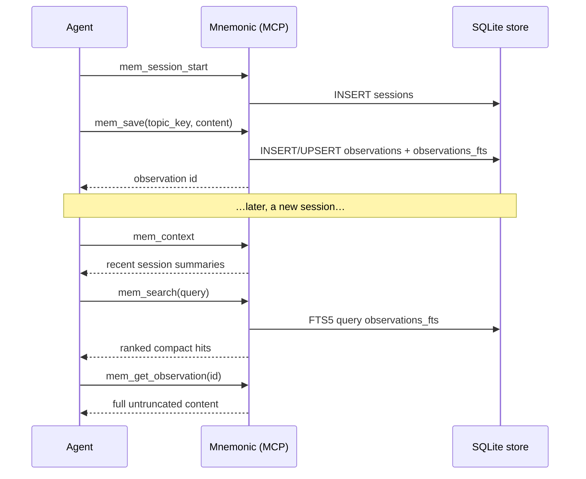
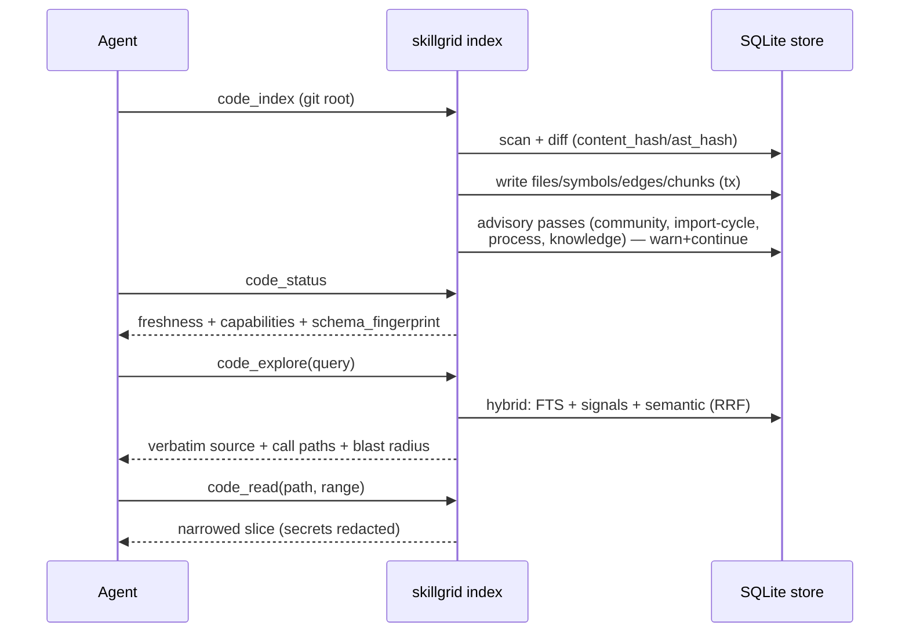
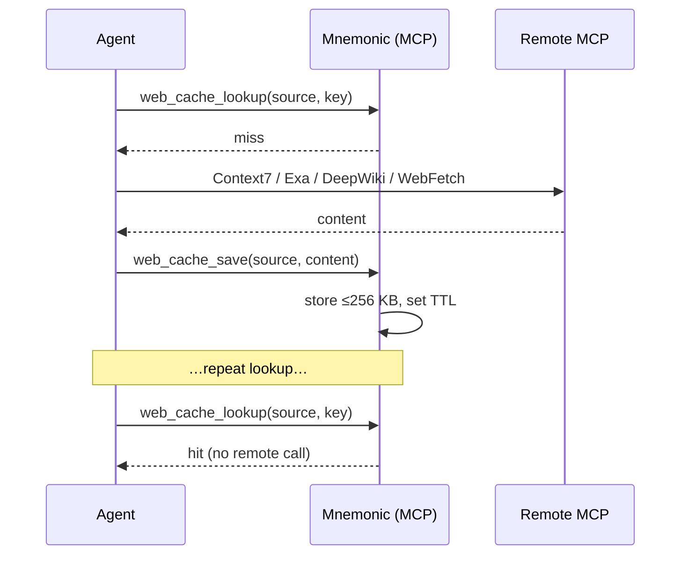

# Memory and indexing

**Mnemonic** is Skillgrid's local-first persistent memory engine — a single SQLite + FTS5 store embedded in the `skillgrid` CLI, exposed to agents over MCP (`skillgrid mcp`), over HTTP + a web dashboard (`skillgrid serve`), and as direct CLI commands.

**Storage stack:** the SQLite database is provided by [`modernc.org/sqlite`](https://modernc.org/sqlite) (pure-Go build of SQLite, **cgo-free**, v1.45.0 in `skillgrid-cli/go.mod`) — the only SQLite extension in use is **FTS5**, compiled into the driver; no `json1`, `rtree`, `vec0`, or loadable extensions (verified against `internal/mnemonic/store/`).

Everything lives in **one per-project database** at `~/.skillgrid/mnemonic/<project>.sqlite` (override the directory with `SKILLGRID_MNEMONIC_DATA_DIR`). The store is single-connection (`MaxOpenConns=1`) and WAL-journaled; memory, code, and web cache are three views over the same file, not three databases.

Mnemonic has **three functions**, plus a cross-cutting layer of agent-orchestration tools:

| Function | Purpose | MCP prefix |
|----------|---------|------------|
| **Memory** | Durable observations, sessions, layered (L0–L3) distillation, governance, recall | `mem_*`, `semantic_*`, `load_*`, `mnemonic_commit`, `session_*`, `knowledge_*` |
| **Code index** | Incremental AST graph + BM25 + hybrid + semantic search, impact, communities, PDG/taint | `code_*` |
| **Web cache** | TTL-cached remote research snapshots | `web_cache_*` |
| **Team orchestration** (cross-cutting) | Spawn/claim/complete tasks across agents | `team_*`, `agent_*` |

That is **77 MCP tools** in total (27 memory · 32 code · 5 web cache · 3 session · 5 agent · 1 team · 1 knowledge · 1 semantic · 1 load · 1 mnemonic).

---

## Quick path

```
skillgrid mcp              # agent tools (stdio) — the 77 MCP tools below
skillgrid serve            # HTTP API + Web UI (default 127.0.0.1:7438)
skillgrid index --dir .    # one-shot code index (semantic tier is config-driven; --pdg / --lsp opt-in tiers)
skillgrid search "AuthService"   # intent-routed retrieval
```

Data dir: `~/.skillgrid/mnemonic/<project>.sqlite`.

The rest of this page is a reference: the full MCP tool tables, the database schema (all tables), and the data flows.

---

# Part 1 — Memory

## 1.1 What memory is for

Memory persists what an agent learned, so a future session starts oriented instead of blind. It is **project-scoped** by default (an observation tagged with the CWD-resolved project is visible only in that project) and **scope-tiered** for the few facts that should cross projects: `project` → `user` → `global`.

Save after: bug fixes (with root cause), architecture/design decisions, non-obvious discoveries, config/env setup, established patterns, and user preferences. Use a stable `topic_key` for evolving topics (upsert, don't duplicate). End sessions with `mem_session_summary` — the next session reads it.

**Recall ladder** (cheap → full):

```
mem_context  →  mem_search  →  mem_timeline  →  mem_get_observation
 (recent     (FTS5          (before/after    (full,
  summaries)  keyword)        context)        untruncated)
```

## 1.2 Layered memory (L0 → L3)

Raw observations (L0) are distilled upward into progressively more durable, more abstract layers. `mem_layers` returns the chain for a session or topic, with each layer's provenance link back to its resolvable L0 source:


- **L0** = `observations` rows (the atoms; every `mem_save`).
- **L1** = scenario overview, surfaced by `semantic_search` (returns L1 overviews + abstracts, never full L2 bodies).
- **L2/L3** = durable long-term memories in `long_term_memories` + `tiered_contents`; loaded on demand via `load_full_details`.

`mnemonic_commit` explicitly commits lessons into L2 (durable); L0/L1 remain async. `knowledge_compact` re-thins `.cleave/KNOWLEDGE.md` from handoff/session inputs only — no Fact-Memory dependency.

## 1.3 Memory MCP tools

| Tool | Role |
|------|------|
| `mem_current_project` | Detect project from CWD — never errors; recommended first call. Returns resolved project ID, resolution source, all available projects. |
| `mem_save` | Save a curated observation (`**What**/**Why**/**Where**/**Learned**`). Reuse `topic_key` to upsert an evolving topic. Best-effort links to related obs. |
| `mem_update` | Update an observation in place (non-empty fields only; FTS stays in sync). |
| `mem_delete` | Soft-delete by default (`deleted_at` set, recoverable); `hard=true` removes the row. |
| `mem_get_observation` | Full untruncated content by ID. |
| `mem_search` | FTS5 full-text search. `project` scopes/overrides CWD; `scope` restricts to project/user/global. |
| `mem_context` | Recent session summaries for fast recall before a full search. |
| `mem_timeline` | Chronological before/after around one observation (the progressive-disclosure middle layer). |
| `mem_suggest_topic_key` | Suggest a stable `topic_key` from type + title for upserts. |
| `mem_stats` | Observation count by type, active/total sessions, created-range. |
| `mem_compare` | Record/clear/inspect semantic relations between two obs: `related` \| `compatible` \| `scoped` \| `conflicts_with` \| `supersedes`. |
| `mem_judge` | Record a conflict verdict between two obs (`not_conflict` removes a `conflicts_with` link). |
| `mem_pin` / `mem_unpin` | Pin an obs to sort ahead in `mem_context` and boost `mem_search` (local to this device store). |
| `mem_share` | Widen visibility — the only explicit way out of `private`. Target `team`\|`restricted`\|`agent`; `acl` for restricted/agent. |
| `mem_governance` | Read governance fields: owner, append-only version history, status, retrieval usage, visibility + ACL grants. |
| `mem_layers` | Inspect the L0→L1→L2→L3 chain for a session/topic with provenance links. |
| `mem_capture_passive` | Extract structured learnings from pasted text (recognizes `Key Learnings:` / Lesson / Discovery lines). |
| `mem_save_prompt` | Record a user prompt for future recall (trimmed, bounded, deduped per session). |
| `mem_review` | List obs due for local review, or mark reviewed to reset the cycle. |
| `mem_doctor` | Read-only diagnostics: schema version, WAL state, FTS drift vs base tables, by-type counts, disk size. |
| `mem_merge_projects` | Merge one source project name into the canonical name (idempotent; records the alias). |
| `mem_unify` | Fold several source project stores into one canonical project (idempotent aliases + re-tag). |
| `mem_session_start` | Create a workspace session (required before `mem_save` in OpenCode plugin flows). Optional `title`. |
| `mem_session_set_title` | Rename a session (shown in the web dashboard session list). |
| `mem_session_summary` | Persist the structured end-of-session summary (the `## Goal / Instructions / Discoveries / Accomplished / Next Steps / Relevant Files` block). |
| `mem_session_end` | End a session with an optional summary. |

### Session handoff & tiered recall (cross-memory)

| Tool | Role |
|------|------|
| `session_handoff` | Write a structured handoff: three `.skillgrid/.cleave/` files (PROGRESS / KNOWLEDGE / NEXT_PROMPT) + a `session_handoffs` row. Fails closed — no row if the files can't be written. |
| `session_resume` | Resume a prior session by `handoff_id`: reads the `.cleave/` bundle, returns the stored NEXT_PROMPT. Fails closed on an unknown id. |
| `session_status` | Relay status: handoff count + last known cost/context (optional `context_usage_percent`, `cost_usd`). |
| `semantic_search` | Ranked L1 overviews (with abstracts) over tiered/long-term memory. Never returns full L2 bodies — use `load_full_details`. |
| `load_full_details` | Load full L2 markdown for a path returned by `semantic_search`. |
| `mnemonic_commit` | Explicitly commit lessons into L2 durable (L0/L1 async). Does not run on session end. |
| `knowledge_compact` | Thin-refresh `.cleave/KNOWLEDGE.md` from handoff/session inputs only. |

> **Filesystem & sharing** (`mem fs ls/tree/find` over `mem://`, `mem_share` visibility, `mem export`) are CLI-only — see [1.5 Filesystem access & sharing](#15-filesystem-access--sharing).

## 1.4 Memory data flow



## 1.5 Filesystem access & sharing

Mnemonic can present memory as a **virtual filesystem** and as **shared observations**. This section documents the logic behind each: how to browse the `mem://` URI space, how visibility/sharing is modeled, and how to export a portable share payload.

### Filesystem browse (`mem fs`, CLI only — no MCP tool)

`memfs` exposes a `mem://` URI space with scope-aware `ls`/`tree`/`find`, alongside the existing semantic `mem_search`. The "directories" under a scope are the `memory_type` categories:

```
mem://project/{id}/            → all of project {id}'s observations
mem://project/{id}/preferences → only {id}'s preference-typed observations
mem://user/{id}/               → user {id}'s observations
```

Scopes resolve from the `topic_key` column (pattern `{kind}/{id}/{memory_type}/…`), so no separate schema is needed. It is **read-only** (browse, not mutate).

```bash
skillgrid mem fs ls project/A/              # list a scope
skillgrid mem fs tree project/A/            # hierarchical tree view
skillgrid mem fs find "*auth*" project/A/   # glob pattern across observations
skillgrid mem search "auth" --trajectory    # semantic search + directory drill-down path
```

`--trajectory` prints the directory-recursive retrieval drill-down: the path of `mem_type` directories the search descended through to reach each hit, making retrieval inspectable.

### Sharing (`mem_share` + visibility ladder)

Observations are **private by default**. `mem_share` is the only explicit way to widen visibility, on a four-level ladder with per-observation ACLs (stored in `acl_grants`):

```
private  →  team  →  restricted (per-principal ACL)  →  agent
```

```bash
skillgrid mem share <id> --target-visibility team
skillgrid mem share <id> --target-visibility restricted --grants alice,bob
skillgrid mem governance <id>     # read owner, version history, visibility, ACL grants
```

Visibility is enforced on read (`mem_search` / `mem_context` filter to what the reader can see). `mem_merge_projects` / `mem_unify` fold multiple project stores into one canonical store (the multi-repo share path).

### Export (portable file share)

```bash
skillgrid mem export [--file out.json] [--skip-embeddings]   # COGX JSON (observations + graph edges + embeddings)
skillgrid export --project ID --out DIR                       # Obsidian Markdown + viz JSON
```

These are the only file-based share mechanisms today — a portable payload you hand to someone, not a live mount.

### Current capabilities

| Capability | Status |
|---|---|
| Browse `mem://` with `ls`/`tree`/`find` | done (read-only, CLI) |
| Tiered recall on demand (L0→L3 + `load_full_details`) | done |
| Directory-recursive retrieval with inspectable trajectory (`mem search --trajectory`, `retrieval_trails`) | done |
| Point-in-time snapshots / rollback (`mem snapshot create/restore/list`) | done |
| Per-observation sharing via `mem_share` visibility + `acl_grants` | partial — per-observation only, **no shared/peer `mem://` scope** |
| FS mutations (`cp`/`mv`/`mkdir`/`write`) | not done (memfs is read-only) |
| HTTP file-protocol endpoint (mountable drive) | not done (`skillgrid serve` is a JSON API + dashboard) |

**Bottom line:** filesystem browsing, tiered recall, and export payloads are implemented; live sharing (shared/peer `mem://` scopes, FS writes, a file-protocol server) is not. Sharing today = `mem_share` visibility + `export` payloads, all local-first (one per-project SQLite file, no file-protocol server by default).

---

# Part 2 — Code index

## 2.1 What the index is

An incremental, tree-sitter-based graph of the repo: files → symbols → edges, plus lexical (FTS5) and semantic (embedding) retrieval, plus advisory structural analyses. It is **per-project** (one SQLite file, no cross-project code search).

```
files → symbols → edges (calls / imports / references / extends / route / navigates / …)
                 → chunks → chunks_fts   (BM25 lexical)
                 → embeddings / chunk_embeddings   (semantic, config-driven)
                 → communities / communities_meta   (advisory analytics)
```

The core graph commit is transactional; every advisory pass (community, process, knowledge, import-cycle, resolution-audit, LSP, PDG) runs **after** the commit and is warn-and-continue — a pass failure never rolls back the committed graph.

## 2.2 Orientation ladder (canonical order)

```
code_status → code_index (if not fresh) → code_map → code_search → code_read
```

`code_status` reports `freshness` (`fresh` | `lag` | `empty` | `unknown`); compat `stale=true` means empty-only, not lag. Reindex when not `fresh`. Prefer index tools over `rg` for **unfamiliar** large repos; use `rg`/`grep` for exact identifiers.

## 2.3 Code MCP tools

### Search & retrieval

| Tool | Role |
|------|------|
| `code_status` | Index health + freshness, `capabilities` block (graph/fts/vector+dims), `resolution_audit`, `unresolved_members`, `import_cycles`, `schema_fingerprint`. |
| `code_index` | Incremental index for the cwd git root (respects `indexing.yaml`). |
| `code_search` | BM25 full-text over indexed chunks. |
| `code_hybrid_search` | Offline hybrid: FTS + deterministic signals (proximity, TF-IDF, type/API) + semantic vectors via RRF. Every hit carries per-signal provenance. |
| `code_semantic_search` | Semantic (embedding) search. Symbol-level hits → file+line; chunk-level → line range. Requires an active embedder; `language` param for exact index-level filtering. |
| `code_embedding_status` | Active provider (onnx/external/off), model, dim, embedded count, model-swap guard. |
| `code_explore` | **Primary** code-intelligence tool: relevant symbols' verbatim source grouped by file, call paths between them (incl. INFERRED dispatch hops), and blast radius — one call. |
| `code_grep` | Structural by-example search: metavariable pattern (`\name`, `\(ARGS*)`, `\*`) against the tree-sitter syntax tree (dialect v1+v2). |

### Orient & read

| Tool | Role |
|------|------|
| `code_map` | Structural overview from the index (not a prose dump). |
| `code_orient` | Tier-1 orientation: symbol metadata, signature, file TOC, symbol list, linked rationale. |
| `code_signature` | Just the signature + span of a resolved symbol. |
| `code_file_toc` | Table of contents (every symbol, in line order) for the file containing a symbol. |
| `code_read` | Indexed source for a path + optional range — **after** search narrowed the location. Never read whole files speculatively. |
| `code_explain` | A symbol's node, degree, and all connections ranked by neighbor degree (hubs first). |
| `code_related` | Neighbors via Edges. |
| `code_rationale` | Rationale comments (`# NOTE:` / `# WHY:` / ADR-RFC) linked to a symbol's nearest enclosing definition. |

### Impact & navigation

| Tool | Role |
|------|------|
| `code_impact` | Risk-tiered blast radius: depth-1 dependents WILL BREAK, deeper LIKELY AFFECTED. Every edge confidence-tagged; `min_confidence` filters low-confidence hops. |
| `code_affected` | PR command: which tests to run after a change. Traverses changed files → affected tests via import + tests_for (and resolved route) edges, depth-capped. Additive; traverses resolved edges only. |
| `code_rename` | PR command: what renaming a symbol touches. Splits into graph edits (high-confidence) + text-search edits (flagged). `dry_run` default true. |
| `code_path` | Shortest edge path between two symbols (each hop confidence-labeled); if no static path, a "where the graph stops" answer. |
| `code_route` | Framework routes: route nodes (URL + method + framework) and their `references` edges to handlers. |
| `code_navigates` | Framework navigation (screen → screen) edges. |

### Structural & analytical

| Tool | Role |
|------|------|
| `code_communities` | Leiden subsystems, LLM-free labeled, each with a **cohesion** score. Seeded/reproducible (content-hash cache). |
| `code_god_nodes` | Most-connected symbols by degree; `exclude_hubs` suppresses utility super-hubs. |
| `code_explain_community` | A community's members (symbol, kind, path, line), entry points, and **cohesion**. |
| `code_processes` | Precomputed process flows (execution traces from entry points through call chains), each step confidence-labeled + LLM/deterministic label. |
| `code_process` | The full step-by-step trace of one named process, with the "stops at \<symbol\> (\<reason\>)" note. |
| `code_docs` | Indexed markdown docs + their `references` edges (EXTRACTED link / INFERRED wikilink). |
| `code_configs` | Indexed config files + their `configures` edges to the code they configure. |
| `code_sql_schema` | Indexed SQL schema nodes (tables + columns parsed from DDL). |
| `code_sql_access` | reads/writes edges between code symbols and SQL tables (parsed from DML). |
| `code_unresolved_refs` | Unresolved reference drops (route-handler refs that failed to resolve — drop-not-guess), each with match count. |
| `code_pdg_query` | (opt-in `--pdg`) CFG/PDG: control- and data-dependents of a statement inside a function. |
| `code_taint` | (opt-in `--pdg`) Intraprocedural source→sink taint findings. |

## 2.4 Extraction & indexing data flow

```mermaid
flowchart TD
  SCAN["skillgrid index --dir .<br/>git-root scan (indexing.yaml include/exclude)"] --> DIFF{"file changed?<br/>(mtime + content_hash + ast_hash)"}
  DIFF -->|no| SKIP["skip (fingerprint gate)"]
  DIFF -->|yes| EX["extract: tree-sitter adapter<br/>(30 langs, CGo in adapter)<br/>+ regex fallback"]

  EX --> S["symbols<br/>(name, kind, lang, sig,<br/>return_type, param_types,<br/>visibility, is_exported)"]
  EX --> E["edges<br/>(calls, imports, references,<br/>extends, route, navigates,<br/>dynamic_import)"]
  EX --> R["rationale + unresolved_members<br/>+ per-lang resolution_audit"]
  EX --> C["chunks (kind=lines|ast)<br/>AST-boundary, full-file coverage"]

  S --> SFTS["symbol_fts (FTS5)"]
  C --> CFTS["chunks_fts (FTS5)"]
  S & C -->|embedPass (config)| VEC["embeddings + chunk_embeddings<br/>(language-partitioned)"]
  S & E --> CM["communities + community_meta<br/>(Leiden + cohesion)"]
  E --> IC["import_cycles (color-DFS)"]
  E --> PR["processes + process_steps<br/>(entry-point traces)"]
  E --> KN["doc_nodes / config_nodes / sql_schema_nodes"]

  subgraph advisory
    CM & IC & PR & KN
  end
```

### Search data flow



No embedder → the semantic leg is **explicitly** `degraded=true` with a reason + fallback. Never silent degrade to FTS-as-semantic.

---

# Part 3 — Web cache

## 3.1 What the cache is for

A TTL-cached snapshot store for remote research, so a repeat lookup doesn't re-hit Context7 / Exa / DeepWiki / WebFetch. The protocol is **lookup-first**:

```
web_cache_lookup(source, …)  →  hit? use it
                                 miss/stale? → remote MCP call
web_cache_save(source, content, …)   # immediately after the remote call (cap 256 KB)
```

"What did we find about X online?" → `web_cache_search(query)` → `web_cache_get(id)`.

## 3.2 Web cache MCP tools

| Tool | Role |
|------|------|
| `web_cache_lookup` | Check the cache before a remote MCP call. Returns hit/miss/stale + entry id. |
| `web_cache_save` | Persist a snapshot after a remote MCP or fetch. Cap 256 KB per snapshot — summarize first. |
| `web_cache_search` | FTS5 search over cached research. |
| `web_cache_get` | Full untruncated snapshot by id. |
| `web_cache_status` | Health: counts by source, expired entries, oldest/newest fetch. |

## 3.3 Web cache data flow



Default TTLs: context7 30d, exa/fetch 7d, deepwiki 14d, manual never.

---

# Part 4 — Database schema

All tables live in the single per-project SQLite file. FTS5 shadow tables (`*_fts_content`, `*_fts_data`, `*_fts_docsize`, `*_fts_idx`, `*_fts_config`) are shown collapsed as `*_fts`. Row counts are from a live aiskillgrid index (code + 5 observations); memory-heavy cells vary by project.

## 4.1 Memory tables

| Table | Purpose | Key columns |
|-------|---------|-------------|
| `observations` | L0 atoms — every saved memory | `id`, `session_id`, `type`, `title`, `content`, `project`, `scope`, `topic_key`, `normalized_hash`, `revision_count`, `source`, `pinned`, `expires_at`, `embedding`/`embedding_model`, `visibility`, `owner`, `status`, `importance_score`, `recency_decay`, `maturity_tier`, `provenance` |
| `observations_fts` | FTS5 over observations | `content` (external-content) |
| `observation_versions` | Append-only version history (governance) | `observation_id`, `content`, `created_at` |
| `observation_relations` | Typed links between observations | `from_id`, `to_id`, `relation` |
| `memory_relations` | Cross-observation semantic relations | `obs_a`, `obs_b`, `relation` |
| `acl_grants` | Visibility ACLs for shared obs | `observation_id`, `principal`, `access` |
| `prompts` / `prompts_fts` | Saved user prompts | `session_id`, `text` |
| `sessions` / `session_archives` | Workspace sessions | `id`, `project`, `directory`, `started_at`, `ended_at`, `summary`, `status`, `title`, `compression_index` |
| `session_handoffs` | Relay handoffs (→ `.cleave/` bundle) | `handoff_id`, `source_session`, `status`, `cleave_path`, `context_summary` |
| `handoff_meta` | Handoff pass metadata | `key`, `value` |
| `observation_layers` | L0–L3 layer provenance | `project`, `layer`, `target_kind`, `target_id`, `source_session`, `source_topic`, `content_hash` |
| `long_term_memories` | L2/L3 durable memories | `project`, `title`, `tiered_content_id`, `source_link`, `full_path`, `abstract_path`, `overview_path`, `embedding_blob` |
| `tiered_contents` | Tiered L1/L2/L3 content bodies | `id`, `layer`, `content` |
| `personas` | Distilled persona deltas (L2) | `project`, `content`, `updated_at` |
| `retrieval_trails` | Retrieval provenance audit | `session_id`, `query`, `hits_json` |
| `distill_llm_cache` | LLM distillation cache | `input_hash`, `output` |
| `snapshots` / `ttl_config` | Snapshot store + TTL overrides | — |
| `project_aliases` | Source→canonical project aliases | `alias`, `canonical` |

## 4.2 Code index tables

### Core graph (transactional)

| Table | Purpose | Key columns |
|-------|---------|-------------|
| `files` | Indexed files | `id`, `path`, `mtime_ns`, `size`, `content_hash`, `indexed_at`, `ast_hash` |
| `symbols` | Code units (function/method/type/route/…) | `id`, `file_id`, `name`, `qualified_name`, `kind`, `language`, `signature`, `start_line`, `end_line`, `content_hash`, `uid`, `hub_score`, `return_type`, `param_types`, `visibility`, `is_exported` |
| `edges` | Symbol→symbol relationships | `id`, `kind`, `from_id`, `file_id`, `to_id`, `to_name`, `target_path`, `confidence`, `line`, `valid_from`, `valid_to`, `context`, `confidence_score` |
| `chunks` | Lexical + semantic units | `id`, `file_id`, `start_line`, `end_line`, `text`, `content_hash`, `kind` (`lines`\|`ast`) |
| `symbol_fts` / `chunks_fts` | FTS5 lexical indexes | name/qualified_name/signature/kind/language · chunk text |
| `symbol_segments` | Reverse segment index (substring location) | `symbol_id`, `segment`, `offset` |

Edge `kind` values: `calls`, `imports`, `references`, `extends`, `route`, `navigates`, `dynamic_import`, `configures`, `reads`, `writes`, `tests_for`, `method`. `confidence` is `EXTRACTED` (1.0) / `INFERRED` (0.85) / `AMBIGUOUS` (0.5).

### Semantic tier (config-driven via `mnemonic.embedder`)

| Table | Purpose | Key columns |
|-------|---------|-------------|
| `embeddings` | Symbol vectors (name+signature) | `symbol_id`, `model`, `dim`, `vector` (BLOB), `updated_at`, `language` |
| `chunk_embeddings` | Chunk-text vectors (non-symbol code) | `chunk_id`, `model`, `dim`, `vector`, `updated_at`, `language` |
| `lsh_buckets` | LSH acceleration buckets | `model`, `dim`, `bucket`, `ref_id` |
| `path_embeddings` | File-path embeddings (topical locality) | `file_id`, `vector` |
| `embed_meta` | Embedder model + dim registry (model-swap guard) | `model`, `dim`, `active` |

### Advisory analytics (never load-bearing)

| Table | Purpose | Key columns |
|-------|---------|-------------|
| `communities` / `community_meta` | Leiden partition + per-community meta | `id`, `symbol_id` · `id`, `label`, `symbol_count`, `god_nodes`, `hub_label`, `cache_key`, `cohesion` |
| `community_meta_cache` | Content-hash cache key | `key`, `value` |
| `import_cycles` | File import dependency loops | `cycle` (comma paths, closed), `node_count`, `discovered` |
| `processes` / `process_steps` / `process_meta_cache` | Entry-point execution traces | `name`, `entry_symbol_id`, `cross_community`, `label`, `stop_note` · step hops |
| `route_meta` / `route_drops` | Framework route nodes + unresolved drops | URL/method/framework · dropped handler refs |
| `doc_nodes` / `config_nodes` / `sql_schema_nodes` | Knowledge-graph nodes (docs, configs, SQL DDL) | node text + parsed structure |
| `rationale` | Rationale comments linked to a symbol | `symbol_id`, `text`, `kind` (`note`\|`why`\|`adr`), `line` |
| `unresolved_refs` | Dropped reference targets (drop-not-guess) | `name`, `kind`, `line`, `match_count` |
| `unresolved_members` | Unbound receiver-qualified calls (internal/external split) | `file_id`, `language`, `member`, `receiver`, `external`, `line` |
| `resolution_audit` | Per-language call-resolution ledger | `language`, `call_sites`, `unresolved` |
| `cfg_blocks` / `cfg_edges` / `pdg_edges` / `taint_findings` | (opt-in `--pdg`) per-function CFG/PDG + taint | blocks, control/data edges, taint paths |
| `index_freshness` / `index_meta` / `index_meta_kv` / `fingerprint_meta` / `extraction_metadata` | Freshness + migration + schema-fingerprint bookkeeping | — |

## 4.3 Web cache tables

| Table | Purpose | Key columns |
|-------|---------|-------------|
| `web_cache` | Snapshot store | `id`, `project`, `source`, `cache_key`, `url`, `title`, `query`, `library_id`, `version_tag`, `content`, `metadata_json`, `content_hash`, `fetched_at`, `expires_at`, `session_id` |
| `web_cache_fts` | FTS5 over cached content | `content` (external-content) |

## 4.4 Orchestration tables (team)

| Table | Purpose |
|-------|---------|
| `teams` / `team_members` | Team + member registry |
| `tasks` / `task_results` | Task queue + outputs |
| `reviews` | Peer reviews (spec_compliance / code_quality) |
| `messages` | Threaded member messages |

## 4.5 Schema map



---

# Part 5 — End-to-end data flows

## 5.1 A save + recall round-trip (memory)



## 5.2 Index + orient round-trip (code)



## 5.3 Research cache round-trip (web)



---

# Part 6 — Configuration & operations

## 6.1 SQLite extensions & storage stack

Mnemonic runs on **`modernc.org/sqlite`** v1.45.0 (`skillgrid-cli/go.mod`) — the pure-Go, cgo-free port of the SQLite C library. `skillgrid doctor` reports `cgo: free (modernc.org/sqlite + gotreesitter)`.

**Extensions actually used: FTS5 only.** Everything else is stock SQLite:

| Extension | Used? | Where / notes |
|-----------|-------|---------------|
| **FTS5** | yes | The only extension in play. Five virtual tables, all external-content with trigger sync: `observations_fts` (`tokenize='porter'`), `chunks_fts`, `symbol_fts` (`tokenize='unicode61'`), `prompts_fts`, `web_cache_fts`. Rank queries use the `bm25()` built into FTS5. |
| JSON1 | no | No `json_extract`/`json_each`/`json_array` anywhere in Go or migration SQL — JSON payloads (`metadata_json`, `hits_json`, graph edges) are stored as TEXT and parsed in Go. |
| rtree / rtree* | no | No spatial queries. |
| vec0 (sqlite-vec) | no | Semantic search keeps vectors as BLOBs in `embeddings` / `chunk_embeddings` / `path_embeddings` and does brute-force cosine ranking in Go; `lsh_buckets` is a plain table, not a vec0 index. |
| Loadable extensions (`sqlite3_load_extension`) | no | Extensions are never loaded at runtime; what is compiled into modernc's SQLite build is all there is. |

Consequences of the modernc choice (documented in the code):

- **No `sha1()` SQL function** — content hashes and cache keys are computed in Go, not in SQL (`process/trace.go`, `community/leiden.go`).
- **No regexp / string char functions** — the session-title backfill migration was kept in Go for that reason (`migrations/003_backfill_session_titles.sql`).
- **No `ON CONFLICT` against partial indexes** — conflicts are handled in Go (`memory/relations.go`).

Connection-level tuning (PRAGMAs applied in `store.openDatabase`, `store.go`):

```
PRAGMA journal_mode=WAL      -- WAL journal (single connection, MaxOpenConns=1)
PRAGMA foreign_keys=ON
PRAGMA busy_timeout=10000    -- absorbs the transient WAL lock from the session-close distill hook
```

WAL-locked opens are retried with backoff (50ms → 100ms → 200ms, 3 attempts total) before failing.

## 6.2 Indexing config

Config file `config.d/indexing.yaml`, searched up from the indexed dir; repo-local and `~/.skillgrid/config.d/indexing.yaml` override defaults.

| Field | Default | Meaning |
|-------|---------|---------|
| `chunk_lines` | `80` | Fixed line-window size for `lines` chunks (AST chunks use the ~1000-char target) |
| `chunk_overlap` | `10` | Overlap between line windows |
| `max_file_size_kb` | `512` | Hard cap; larger files skipped |

`skillgrid index` flags: `--dir` (default `.`), `--project` (pin identity, else `SKILLGRID_MNEMONIC_PROJECT`), `--pdg` (CFG/PDG + taint), `--lsp` (LSP edge tier). There is **no `--embeddings` flag** — the semantic tier is config-driven via `mnemonic.embedder` (see 6.2.1).

### 6.2.1 Embedding providers & config

**Embedding is config-driven, not flag-driven.** The provider is chosen from the `mnemonic.embedder` section of `config.d/indexing.yaml` and applies to indexing automatically — `skillgrid index` has **no `--embeddings` flag** (only `-dir`, `-project`, `-pdg`, `-lsp`). Set `mnemonic.embedder.provider` and re-index; the vectors are written by the index pass.

| Leg | How it turns on |
|---|---|
| **Indexing** (code symbol + chunk vectors) | Always, whenever a provider is configured (default `onnx`). No flag, no env. |
| **Retrieval** (semantic *search* leg in `code_semantic_search` / `code_hybrid_search`) | Gated by `MNEMONIC_EMBED=1` (default off) — `embedder.Default()`. |

A provider that can't load (e.g. Ollama down, missing local model) **degrades to the Null adapter** (no vector leg; FTS + signals floor stays on) with a logged warning.

Provider table — `mnemonic.embedder` keys (`embedder.BuildFromConfig`, `select.go`):

| `provider` | Behavior | Keys used |
|---|---|---|
| `onnx` **(default)** | In-process ONNX; default model `nomic-embed-code`, 768-dim. Missing model → hash fallback. | `model`, `dimension`, `indexing_params`, `query_params` |
| `ollama` | `POST {model,prompt}` to `<base_url>/api/embeddings`. Probed at selection; server down → degrade to Null. | `base_url` (default `http://localhost:11434`), `model` (default `nomic-embed-code`), `dimension` |
| `local` | Loads `<model_dir>/<model>.onnx` in-process. Missing file is a load error → degrade to Null. | `model_dir` (default `~/.skillgrid/models/`), `model`, `dimension` |
| `external` | Any OpenAI-compatible endpoint; tries `/embeddings`, falls back to `/api/embed` (Ollama). Asymmetric-capable. | `base_url`, `model`, `api_key`, `dimension`, `indexing_params`, `query_params` |
| `off` / `""` | Null adapter — no vector leg. | — |

**Asymmetric** params: `indexing_params` (corpus side) and `query_params` (query side) each take `instructions`, `input_type`, `max_tokens`. Only `onnx`/`external` honor them.

Ollama example (repo-local `config.d/indexing.yaml` or `~/.skillgrid/config.d/indexing.yaml`):

```yaml
mnemonic:
  embedder:
    provider: ollama
    base_url: http://localhost:11434
    model: nomic-embed-code
    dimension: 768
```

Then re-index: `skillgrid index --dir .` (the provider from the config above applies automatically). To also enable the semantic *search* leg at retrieval time, set `MNEMONIC_EMBED=1`. Verify with `code_embedding_status` (reports active provider/model/dim/embedded count) or `skillgrid doctor` (runs an embed round-trip).

Two guards:
- **Fail-safe** — a provider that fails to load degrades to Null with a logged warning (`degradeOnError`); the pipeline never hard-fails on embedding.
- **Model-swap guard** — `embed_meta` records model+dim; a model or dimension change invalidates existing vectors and triggers re-embed on next index.

## 6.3 Environment variables

| Variable | Role |
|----------|------|
| `SKILLGRID_MNEMONIC_DATA_DIR` | Data directory (default `~/.skillgrid/mnemonic`) |
| `SKILLGRID_MNEMONIC_PORT` | Serve port (default 7438) |
| `SKILLGRID_HTTP_TOKEN` | Bearer for write routes |
| `SKILLGRID_MNEMONIC_PROJECT` | Pin project for `index` / tools |
| `SKILLGRID_MNEMONIC_HTTP_URL` | Plugin → serve URL |
| `SKILLGRID_NO_WATCH=1` | Disable the watcher (manual index; fingerprint gate is the backstop) |
| `MNEMONIC_EMBED` | Enable the semantic **search** leg in retrieval (`1`/`true`/`yes`/`on`); default off. Indexing is separate — config-driven via `mnemonic.embedder`, no env |

## 6.4 Project identity

Each git repo binds to a **clone-private** identity under `.git/` so memory survives rename, re-clone, and linked worktrees. A parent of many repos → ambiguous; pick a project explicitly or set `SKILLGRID_MNEMONIC_PROJECT`. Fold multiple directory-hashed stores into one with `mem_unify` / `mem_merge_projects`.

## 6.5 HTTP API & dashboard

`skillgrid serve` exposes the same data over HTTP + a read-only dashboard (Memory Visualization + Code Graph: 3-pane callers | source | callees, blast radius, symbol search, entry points, flow/path). Plugins auto-start it if `/health` fails. Write routes may require `SKILLGRID_HTTP_TOKEN`. See [Web UI](10-webui.md).

## 6.6 CLI quick reference

```bash
skillgrid mcp [--debug]            # stdio MCP server (the 77 tools)
skillgrid serve [--port 7438]      # HTTP API + dashboard
skillgrid index [--dir .] [--project ID] [--pdg] [--lsp]
skillgrid search [--corpus code|grep|mem|symbols|hybrid|semantic] <query>
skillgrid code <map|get-symbol|get-signature|symbols-in-file|impact|get-callers|index-status|…>
skillgrid trail <recent|show>      # inspect retrieval trails
skillgrid export --project ID --out DIR   # Obsidian Markdown + viz JSON
skillgrid setup <opencode|kilocode|cursor>  # install plugins + register MCP
skillgrid migrate [--tier]         # backfill tier sidecars
skillgrid doctor [--strict]        # functional health check (embed round-trip, capabilities)
```

## 6.7 Gotchas

- `code_index` indexes the **git root**, not the cwd.
- Semantic path without an embedder → **explicit** `degraded=true`, never silent.
- `stale=true` ≠ lag; use `freshness`.
- The code index is **per-project** (one SQLite file); no cross-project code search.
- The store is **single-connection** (`MaxOpenConns=1`); advisory passes reopen the DB after the core commit to avoid the write-lock deadlock.
- Go import targets are stored as **leaf names**, so Go import-cycle detection only ever reports cycles for in-repo file pairs when full module paths are persisted.

## 6.8 Protocol reference

Full agent-facing conventions (not this operator reference):

- `.agents/skills/_shared/conventions/mnemonic-memory.md`
- `.agents/skills/_shared/conventions/mnemonic-code-indexing.md`
- Skill: `mnemonic` (memory + code index + web cache folded in; former `mnemonic-code-index` skill retired → redirect)

## Next step

[Ticketing](08-ticketing-integrations.md) · [Web UI](10-webui.md)
