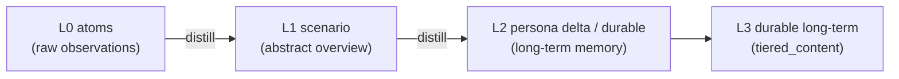
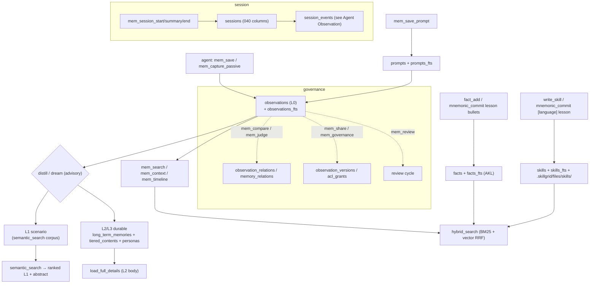
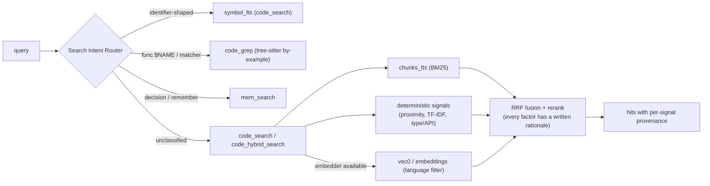
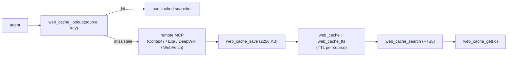
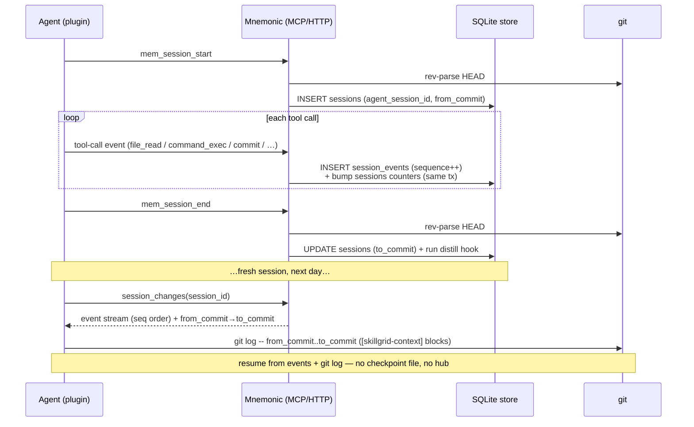
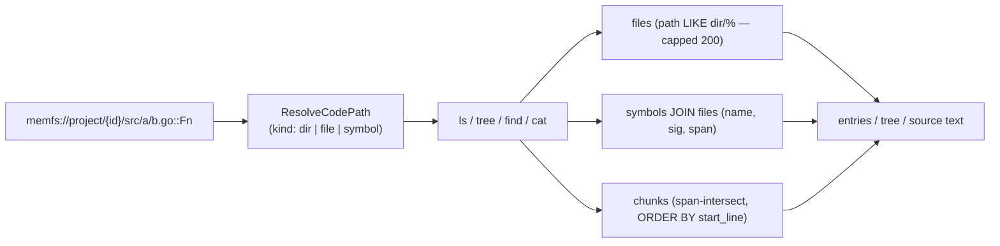

# Memory and indexing

**Mnemonic** is the second brain of your project — Skillgrid's local-first store of durable knowledge, not a scratchpad for chat. It is a single SQLite store embedded in the `skillgrid` CLI, exposed to agents over MCP (`skillgrid mcp`), over HTTP + a web dashboard (`skillgrid serve`), and as direct CLI commands (`skillgrid mem fs`, `skillgrid index`, `skillgrid search`). A chat window is a working set: it fills, compacts, and dies. Mnemonic is what survives — the decisions, a live map of the code, the research, and a record of what each agent session did — so a fresh session opens already oriented instead of blind.

**Storage stack:** the database is provided by [`modernc.org/sqlite`](https://modernc.org/sqlite) (pure-Go build of SQLite, **cgo-free**) — the only extensions in use are **FTS5** (compiled into the driver) and **vec0** (cgo-free vector index from `modernc.org/sqlite/vec`, migration 042). No `json1`, `rtree`, or loadable extensions. JSON payloads are stored as TEXT and parsed in Go.

Everything lives in **one per-project database** at `~/.skillgrid/mnemonic/<project>.sqlite` (override the directory with `SKILLGRID_MNEMONIC_DATA_DIR`). The store is single-connection (`MaxOpenConns=1`) and WAL-journaled; memory, code index, web cache, and session events are views over the same file, not separate databases.

Mnemonic has **six major functions**, documented below — one `##` section each:

| Function | Purpose |
|----------|---------|
| [**Memory**](#memory) | Durable observations, layered L0–L3 distillation, governance, Fact Memory, Agent Skills, hybrid/semantic recall |
| [**Code index**](#code-index) | Incremental AST graph + BM25/hybrid/semantic search, impact, communities, PDG/taint |
| [**Web cache**](#web-cache) | TTL-cached remote research snapshots (Context7 / Exa / DeepWiki / WebFetch) |
| [**Second brain**](#second-brain) | Commit-driven durable memory: lesson capture → fact extraction → auto-skill registration |
| [**Agent Observation**](#agent-observation) | Session events layer (per-tool-call audit stream) and session handoff via git |
| [**Memfs**](#memfs) | OpenViking-style `memfs://` share interface: walk the indexed repo tree as a virtual filesystem |

---

## Quick path

```
skillgrid mcp              # agent tools (stdio) — MCP surface below
skillgrid serve            # HTTP API + Web UI (default 127.0.0.1:7438)
skillgrid index --dir .    # one-shot code index (semantic tier config-driven; --pdg / --lsp opt-in)
skillgrid search "AuthService"   # intent-routed retrieval
skillgrid mem fs tree src/       # walk the code index as a virtual filesystem
```

Data dir: `~/.skillgrid/mnemonic/<project>.sqlite`. The rest of this page documents, per function: what it does, its MCP tools, its HTTP/API interface, its SQLite tables, and its dataflow.

---

## Memory

Durable, project-scoped observations — what an agent learned (decisions, discoveries, preferences) — plus a layered distillation into progressively more durable memories, a fact store, an agent skills registry, and recall over lexical, hybrid, and semantic channels.

### Function

Memory persists what an agent learned so a future session starts oriented instead of blind. Observations are **project-scoped** by default (an observation tagged with the CWD-resolved project is visible only in that project) and **scope-tiered** for facts that cross projects: `project` → `user` → `global`. Save after: bug fixes (with root cause), architecture/design decisions, non-obvious discoveries, config/env setup, established patterns, and user preferences. Use a stable `topic_key` for evolving topics (upsert, don't duplicate). End sessions with `mem_session_summary` — the next session reads it.

**Recall ladder** (cheap → full):

```
mem_context  →  mem_search  →  mem_timeline  →  mem_get_observation
 (recent     (FTS5          (before/after    (full,
   summaries)  keyword)        context)        untruncated)
```

**Session start (`skillgrid prime`):** when the project store has recent summaries or observations, prime appends a `## Memory` index (index-only inject — not the full AutoPrepend resume block). Lines list recent session summaries (short id, date, first sentence) then observation rows (pinned first, then newest: `#id type title · date · ~tok`), capped by `mnemonic.inject.max_tokens` by dropping the oldest observation lines first and stating how many were omitted. The footer names `mem_get_observation`, `mem_timeline`, and `mem_search`. An empty store omits the section entirely. Budgets come from `mnemonic.inject` in `config.d/indexing.yaml` (see [Configuration & operations](#configuration--operations)).

**Layered memory (L0 → L3):** raw observations (L0) are distilled upward into progressively more durable, more abstract layers. `mem_layers` returns the chain for a session or topic, with each layer's provenance link back to its resolvable L0 source:


```mermaid
graph LR
  L0["L0 atoms<br/>(raw observations)"] -->|distill| L1["L1 scenario<br/>(abstract overview)"]
  L1 -->|distill| L2["L2 persona delta / durable<br/>(long-term memory)"]
  L2 --> L3["L3 durable long-term<br/>(tiered_content)"]
```

- **L0** = `observations` rows (the atoms; every `mem_save`).
- **L1** = scenario overview, surfaced by `semantic_search` (returns L1 overviews + abstracts, never full L2 bodies).
- **L2/L3** = durable long-term memories in `long_term_memories` + `tiered_contents`; loaded on demand via `load_full_details`.

`mnemonic_commit` explicitly commits lessons into L2 (durable); L0/L1 remain async. The distill/dream passes are advisory — a pass failure never corrupts committed L0 rows.

**Fact Memory & Agent Skills** (migration 011): a separate durable fact store (`facts` + `facts_fts`, AKL importance/decay columns) and an agent skills registry (`skills` + `skills_fts`, code on disk at `.skillgrid/files/skills/{name}.{ext}`). `fact_add`/`fact_search`/`fact_forget`/`fact_decay(_all)` operate the facts with a session-events trail; `write_skill`/`list_skills`/`search_skills`/`use_skill` operate the registry (`use_skill` runs the skill under its language runner with a 10s deadline, 1MB output cap).

**Hybrid & semantic recall:** `hybrid_search` fuses BM25 FTS5 with optional vector RRF over Fact Memory + the Skill registry; `semantic_search`/`load_full_details` walk the L1→L2 tiers; `mem_inject_session` renders a token-cost-annotated context block from hybrid retrieval. Every vector leg **degrades to BM25-only** (`degraded=true`) when no embedder is configured — never a hard fail.

**Governance & sharing:** observations are private by default; `mem_share` is the only explicit path out of `private` (visibility ladder `private → team → restricted → agent`, per-observation ACLs in `acl_grants`). `mem_governance` reads owner, append-only version history (`observation_versions`), status, retrieval usage, visibility. `mem_compare`/`mem_judge` record/clear typed relations (`related | compatible | scoped | conflicts_with | supersedes | not_conflict`). `mem_merge_projects`/`mem_unify` fold multiple project stores into one canonical store (the multi-repo share path).

### MCP tools

**Core memory (24):**

| Tool | Role |
|------|------|
| `mem_current_project` | Detect project from CWD — never errors; recommended first call. Returns resolved project ID, resolution source, all available projects. |
| `mem_save` | Save a curated observation (`**What**/**Why**/**Where**/**Learned**`). Reuse `topic_key` to upsert an evolving topic. Best-effort links to related obs. |
| `mem_update` | Update an observation in place (non-empty fields only; FTS stays in sync). |
| `mem_delete` | Soft-delete by default (`deleted_at` set, recoverable); `hard=true` removes the row. |
| `mem_get_observation` | Full untruncated content by ID. |
| `mem_search` | FTS5 full-text search. `project` scopes/overrides CWD; `scope` restricts to project/user/global; `all_projects` spans every store and merges cross-project ranks; per-owner visibility enforcement (`reader_owner`/`reader_agent`). |
| `mem_context` | Recent session summaries for fast recall before a full search. |
| `mem_timeline` | Chronological before/after around one observation (the progressive-disclosure middle layer). |
| `mem_suggest_topic_key` | Suggest a stable `topic_key` from type + title for upserts. |
| `mem_stats` | Observation count by type, active/total sessions, created-range. |
| `mem_compare` | Record/clear/inspect semantic relations between two obs: `related` \| `compatible` \| `scoped` \| `conflicts_with` \| `supersedes`. |
| `mem_judge` | Record a conflict verdict between two obs (`not_conflict` removes a `conflicts_with` link). |
| `mem_pin` / `mem_unpin` | Pin an obs to sort ahead in `mem_context` and boost `mem_search` (local to this device store). |
| `mem_share` | Widen visibility — the only explicit way out of `private`. Target `team`\|`restricted`\|`agent`; `acl` comma list for restricted/agent. |
| `mem_governance` | Read governance fields: owner, append-only version history, status, retrieval usage, visibility + ACL grants. |
| `mem_layers` | Inspect the L0→L1→L2→L3 chain for a session/topic with provenance links (empty chain never fabricated). |
| `mem_capture_passive` | Extract structured learnings from pasted text (recognizes `Key Learnings:` / Lesson / Discovery lines). Idempotent. |
| `mem_save_prompt` | Record a user prompt for future recall (trimmed, bounded, deduped per session). |
| `mem_review` | List obs due for local review (`review_after <= now`), or mark reviewed to reset the cycle. |
| `mem_doctor` | Read-only diagnostics: schema version, WAL state, FTS drift vs base tables, by-type counts, disk size. |
| `mem_merge_projects` | Merge one source project name into the canonical name (idempotent; records the alias; drift warning if the CWD-resolved project was retired). |
| `mem_unify` | Fold several source project stores into one canonical project (idempotent aliases + re-tag). Admin tool — confirm with the user first. |
| `mem_session_start` | Create a workspace session (required before `mem_save` in OpenCode plugin flows). Optional `title` shown in the dashboard session list. |
| `mem_session_set_title` | Rename a session. |
| `mem_session_summary` | Persist the structured end-of-session summary (Goal / Discoveries / Accomplished / Next Steps / Relevant Files). |
| `mem_session_end` | End a session with an optional summary (runs the distill hook). |

**Tiered & hybrid recall:**

| Tool | Role |
|------|------|
| `semantic_search` | Ranked L1 overviews (with abstracts) over tiered/long-term memory (corpus `ltm`\|`all`). Never returns full L2 bodies. |
| `load_full_details` | Load full L2 markdown for a path returned by `semantic_search`. |
| `hybrid_search` | Hybrid (BM25 FTS5 + optional vector RRF) over Fact Memory + Agent Skill registry, facts and skills ranked side by side with per-leg provenance. |
| `mem_inject_session` | On-demand session context injection: hybrid retrieval of injectable observations rendered into a token-cost-annotated context block (default budget 2000 tokens). `all_projects` widens across buckets. |

**Fact Memory & Agent Skills:**

| Tool | Role |
|------|------|
| `fact_add` | Add a durable fact to Fact Memory + record a session-events trail (requires `content` + `session_id`). |
| `fact_search` | Lexical FTS search over Fact Memory (soft-deleted excluded), bm25-ranked, trail recorded. |
| `fact_forget` | Soft-delete a fact (`deleted_at`), trail recorded. |
| `fact_decay` | Apply the AKL importance decay to one fact (`importance_score *= exp(-decay_rate * age_days)`), trail recorded. |
| `fact_decay_all` | Batch decay + below-threshold purge over all live facts (default threshold 0.5), single batch trail. |
| `write_skill` | Create (or `overwrite`) an Agent Skill: code written to `.skillgrid/files/skills/{name}.{ext}`, metadata in `skills` + `skills_fts`; soft-deleted names are resurrected. |
| `list_skills` | List the registry (live skills, name/language/description/path). |
| `search_skills` | Lexical FTS search over the registry (bm25-ranked). |
| `use_skill` | Execute a registered skill in the sandbox (10s deadline, 1MB output cap); logs a `skill_usage` row + session-events trail. |

### HTTP / API interface

`skillgrid serve` (default `127.0.0.1:7438`) exposes memory over a JSON REST API. Write routes are gated by `SKILLGRID_HTTP_TOKEN` (bearer); read routes are open on the loopback. The embedded web dashboard (Memory Visualization: observations list/detail/edit/share, session list with summaries, timeline) consumes the same routes.

| Route | Method | Purpose |
|-------|--------|---------|
| `/memory/status` · `/memory/last-save-at` | GET | Memory health / last save time |
| `/observations` · `/observations/recent` · `/observations/{id}` | GET | List / recent / fetch observation |
| `/observations` · `/observations/passive` | POST | Save observation / passive capture |
| `/search` | GET | Cross-corpus search (code+mem routing) |
| `/prompts` | POST | Save a user prompt |
| `/memory/timeline` | GET | Chronological context around an observation |
| `/memory/observations/{id}` | PATCH · DELETE | Update / delete |
| `/memory/observations/{id}/pin` · `/unpin` · `/share` · `/status` | POST | Pin, unpin, widen visibility, set status |
| `/memory/observations/{id}/governance` | GET | Governance fields + ACL grants |
| `/memory/reviews` · `/memory/reviews/{id}` | GET · POST | Review list / mark reviewed |
| `/memory/relations` · `/relations/{id}` · `/relations` | POST · DELETE · GET | Create/clear typed relations, inspect |
| `/memory/project` · `/memory/doctor` | GET | Current project / read-only diagnostics |
| `/projects/migrate` · `/projects/merge` | POST | Tier sidecar backfill / merge project stores |
| `/sessions` · `/sessions/{id}` | GET · POST | Session list / create |
| `/sessions/{id}/summary` · `/sessions/{id}/activity` | GET | Session summary / activity counters |
| `/sessions/{id}/end` · `/sessions/{id}/title` | POST | End session (distill hook) / rename |
| `/context` · `/context/compaction` | GET | Context-injection block / compaction payload |
| `/mnemonic/memories` · `/mnemonic/memories/{id}` | GET · PUT | Dashboard list / detail / edit |
| `/mnemonic/memories/{id}/share` · `/status` | POST | Dashboard share / status |
| `/mnemonic/sessions` · `/mnemonic/audit` · `/mnemonic/search` | GET | Dashboard sessions / audit / search |
| `/mnemonic/graph/data` · `/mnemonic/graph/nodes` | GET | Observation-graph data for the viz |
| `/mnemonic/files/tree` · `/mnemonic/files/content` | GET | Dashboard file tree / content |

### SQLite tables

| Table | Purpose | Key columns |
|-------|---------|-------------|
| `observations` | L0 atoms — every saved memory | `id`, `session_id`, `type`, `title`, `content`, `project`, `scope`, `topic_key`, `normalized_hash`, `revision_count`, `source`, `pinned`, `expires_at`, `visibility`, `owner`, `status`, `importance_score`, `recency_decay`, `maturity_tier`, `provenance` |
| `observations_fts` | FTS5 over observations (external-content, trigger-synced, `tokenize='porter'`) | `content` |
| `observation_versions` | Append-only version history (governance) | `observation_id`, `content`, `created_at` |
| `observation_relations` | Typed links between observations (`mem_compare`/`mem_judge`) | `from_id`, `to_id`, `relation` |
| `memory_relations` | Cross-observation semantic relations | `obs_a`, `obs_b`, `relation` |
| `acl_grants` | Visibility ACLs for shared obs (`mem_share`) | `observation_id`, `principal`, `access` |
| `prompts` / `prompts_fts` | Saved user prompts | `session_id`, `text` |
| `sessions` | Workspace sessions (see [Agent Observation](#agent-observation) for the 040-added columns) | `id`, `project`, `directory`, `title`, `status`, `started_at`, `ended_at`, `summary`, `agent_session_id`, `from_commit`, `to_commit`, activity counters |
| `observation_layers` | L0–L3 layer provenance (`mem_layers`) | `project`, `layer`, `target_kind`, `target_id`, `source_session`, `source_topic`, `content_hash` |
| `long_term_memories` | L2/L3 durable memories | `project`, `title`, `tiered_content_id`, `source_link`, `full_path`, `abstract_path`, `overview_path` |
| `tiered_contents` | Tiered L1/L2/L3 content bodies | `id`, `layer`, `content` |
| `personas` | Distilled persona deltas (L2) | `project`, `content`, `updated_at` |
| `facts` / `facts_fts` | Fact Memory (011; AKL `importance_score`/`recency_decay`, soft-delete) | `id`, `project`, `content`, `importance_score`, `deleted_at` |
| `skills` / `skills_fts` | Agent Skills registry (011; code path, soft-delete) | `id`, `name`, `language`, `description`, `code_path`, `deleted_at` |
| `skill_usage` | `use_skill` execution log | `skill_id`, `session_id`, `exit_code`, `output` |
| `retrieval_trails` | Retrieval provenance audit (`mem search --trajectory`) | `session_id`, `query`, `hits_json` |
| `distill_llm_cache` | LLM distillation cache | `input_hash`, `output` |
| `distill_lock` | Distill/dream single-flight lock | `key`, `held_at` |
| `snapshots` / `ttl_config` | Point-in-time snapshots + TTL overrides | — |
| `project_aliases` | Source→canonical project aliases (`mem_merge_projects`/`mem_unify`) | `alias`, `canonical` |

### Dataflow


```mermaid
flowchart TD
  A["agent: mem_save / mem_capture_passive"] --> B["observations (L0)<br/>+ observations_fts"]
  A2["mem_save_prompt"] --> P["prompts + prompts_fts"] --> B
  B --> C{"distill / dream (advisory)"}
  C --> L1["L1 scenario<br/>(semantic_search corpus)"]
  C --> L23["L2/L3 durable<br/>long_term_memories + tiered_contents + personas"]
  L1 --> RS["semantic_search → ranked L1 + abstract"]
  L23 --> LF["load_full_details (L2 body)"]
  B --> RS2["mem_search / mem_context / mem_timeline"]

  F["fact_add / mnemonic_commit lesson bullets"] --> FT["facts + facts_fts (AKL)"]
  S["write_skill / mnemonic_commit [language] lesson"] --> SK["skills + skills_fts + .skillgrid/files/skills/"]
  FT --> HB["hybrid_search (BM25 + vector RRF)"]
  SK --> HB
  RS2 --> HB

  subgraph governance
    B -. mem_compare / mem_judge .-> REL["observation_relations / memory_relations"]
    B -. mem_share / mem_governance .-> GOV["observation_versions / acl_grants"]
    B -. mem_review .-> REV["review cycle"]
  end

  subgraph session
    SS["mem_session_start/summary/end"] --> SES["sessions (040 columns)"]
    SES --> SE["session_events (see Agent Observation)"]
  end
```

Save path: `mem_save` → single-connection transaction inserts the `observations` row + syncs `observations_fts` (trigger) → dedup by `normalized_hash` within 24h, upsert by `topic_key`. Recall path: `mem_search` (FTS5 bm25) → `mem_timeline` (window around a hit) → `mem_get_observation` (full body). Distill path: `mem_session_end` runs the distill hook under `distill_lock` — a provider failure is logged, never propagated.

---

## Code index

An incremental, tree-sitter-based graph of the repo — files → symbols → edges — plus lexical (FTS5), hybrid, and semantic (embedding) retrieval, plus advisory structural analyses (communities, processes, PDG/taint). It is **per-project** (one SQLite file, no cross-project code search).

### Function

```
files → symbols → edges (calls / imports / references / extends / route / navigates / …)
                  → chunks → chunks_fts        (BM25 lexical)
                  → embeddings / chunk_embeddings  (semantic, config-driven)
                  → vec_symbols / vec_chunks    (vec0, derived in-SQL index)
                  → communities / processes     (advisory analytics)
```

The core graph commit is **transactional**; every advisory pass (community, process, knowledge, import-cycle, resolution-audit, LSP, PDG) runs **after** the commit and is warn-and-continue — a pass failure never rolls back the committed graph.

**Orientation ladder (canonical order):**

```
code_status → code_index (if not fresh) → code_search → code_read
```

`code_status` reports `freshness` (`fresh` | `lag` | `empty` | `unknown`) and a `capabilities` block (graph/fts/vector+dims). Reindex when not `fresh`. Prefer index tools over `rg` for **unfamiliar** large repos; use `rg`/`grep` for exact identifiers.

**Tool surfacing:** the narrow `code_*` menu (orient, signature, callers/callees, process, community, …) is **unlisted by default** to keep the MCP surface small — re-enable it with `SKILLGRID_MCP_CODE_TOOLS`. The composite `code_explore` (the primary tool: verbatim source grouped by file + call paths + blast radius in one call) and the four ladder tools (`code_status`/`code_index`/`code_search`/`code_read`) stay listed.

### MCP tools

**Ladder (always listed):**

| Tool | Role |
|------|------|
| `code_status` | Index health + freshness, `capabilities` block, `resolution_audit`, `unresolved_members`, `import_cycles`, `schema_fingerprint`. |
| `code_index` | Incremental index for the cwd git root (respects `indexing.yaml` include/exclude). |
| `code_search` | BM25 full-text over indexed chunks. |
| `code_read` | Indexed source for a path + optional range — **after** search narrowed the location. Never read whole files speculatively. |

**Composite & hybrid (listed):**

| Tool | Role |
|------|------|
| `code_explore` | **Primary** code-intelligence tool: relevant symbols' verbatim source grouped by file, call paths between them (incl. INFERRED dynamic-dispatch hops), and blast-radius summary — one call. Optional `maxTokens` budget. |
| `code_hybrid_search` | Offline hybrid: FTS + deterministic signals (proximity, TF-IDF, type/API) + semantic vectors via RRF. Every hit carries per-signal provenance. Degrades to FTS+signals (never a hard fail). |
| `code_semantic_search` | Semantic (embedding) search. Symbol-level hits → file+line; chunk-level → line range. Requires an active embedder. |
| `code_embedding_status` | Active provider (onnx/external/off), model, dim, embedded count, model-swap guard. |
| `code_grep` | Index-free structural by-example search: metavariable pattern (`\name`, `\(ARGS*)`, `\*`/`\_`) against the gotreesitter syntax tree of files under a directory. |

**Menu (unlisted by default; `SKILLGRID_MCP_CODE_TOOLS`):**

| Tool | Role |
|------|------|
| `code_orient` | Tier-1 orientation: symbol metadata, signature, file TOC, symbol list, linked rationale. |
| `code_signature` | Just the signature + span of a resolved symbol. |
| `code_file_toc` | Table of contents (every symbol, in line order) for the file containing a symbol. |
| `code_rationale` | Rationale comments (`# NOTE:` / `# WHY:` / ADR-RFC) linked to a symbol's nearest enclosing definition. |
| `code_get_callers` / `code_get_callees` | In/out edge neighbors of a symbol, each confidence-labeled (EXTRACTED/INFERRED/AMBIGUOUS). |
| `code_dependents` | Depth-N dependent subgraph (reverse edges). |
| `code_implementors` / `code_hierarchy` | `implements`/`extends` neighbor views. |
| `code_tests_for` | Tests covering a symbol (`tests_for` edges + resolved route). |
| `code_path` | Shortest edge path between two symbols (each hop confidence-labeled); if no static path, a "where the graph stops" answer. |
| `code_explain` | A symbol's node, degree, and all connections ranked by neighbor degree (hubs first). |
| `code_impact` | Risk-tiered blast radius: depth-1 dependents WILL BREAK, deeper LIKELY AFFECTED. Every edge confidence-tagged; `min_confidence` filters low-confidence hops. |
| `code_communities` | Leiden subsystems, LLM-free labeled (content-hash seeded, reproducible), each with a cohesion score. |
| `code_god_nodes` | Most-connected symbols by degree; `exclude_hubs` suppresses utility super-hubs. |
| `code_explain_community` | A community's members (symbol, kind, path, line), entry points, cohesion. |
| `code_processes` | Precomputed process flows (execution traces from entry points through call chains), each step confidence-labeled + LLM/deterministic label (empty when down — never fabricated). |
| `code_process` | The full step-by-step trace of one named process, with the "stops at \<symbol\> (\<reason\>)" note. |
| `code_route` | Framework routes: route nodes (URL + method + framework) and their `references` edges to handlers. |
| `code_navigates` | Framework navigation (screen → screen) edges (query-only). |
| `code_docs` | Indexed markdown docs + their `references` edges (EXTRACTED link / INFERRED wikilink). |
| `code_configs` | Indexed config files + their `configures` edges (EXTRACTED explicit / INFERRED conventional / AMBIGUOUS kept-not-dropped). |
| `code_sql_schema` | Indexed SQL schema nodes (tables + columns parsed from DDL). |
| `code_sql_access` | `reads`/`writes` edges between code symbols and SQL tables (parsed from DML). |
| `code_unresolved_refs` | Unresolved reference drops (route-handler refs that failed to resolve — drop-not-guess), each with match count. |
| `code_pdg_query` | (opt-in `index --pdg`) Per-function CFG/PDG: control- and data-dependents of a statement. Empty tables → "run index --pdg" message, never an error. |
| `code_taint` | (opt-in `index --pdg`) Intraprocedural source→sink taint findings, hop-by-hop with confidence labels. `--json` for CI. |
| `code_affected` | PR command: which tests to run after a change. Traverses changed files → affected tests via import + tests_for (+ resolved route) edges, depth-capped (default 5); traverses **resolved edges only** (step-01 drop policy). Inputs: `changed` list, stdin (`git diff --name-only`), or `base` git ref. |
| `code_rename` | PR command: what renaming a symbol touches. Disambiguation → ranked candidate list (no silent pick); splits graph edits (high-confidence) + text-search edits (flagged). `dry_run` default true; `apply` edits only the files in the plan (no commit/push). |

### HTTP / API interface

`skillgrid serve` exposes the code index for the dashboard's Code Graph pane (3-pane callers | source | callees, blast radius, symbol search, entry points, flow/path):

| Route | Method | Purpose |
|-------|--------|---------|
| `/code/status` | GET | Index health + capabilities |
| `/code/index` | POST | Trigger an incremental index (write-auth) |
| `/code/files` | GET | Indexed file listing (dashboard file tree) |
| `/code/search` | GET | BM25/hybrid code search |
| `/code/read` | GET | Indexed source slice (path + range) |
| `/mnemonic/graph/data` · `/mnemonic/graph/nodes` | GET | Graph data for the Code Graph viz |
| `/mnemonic/files/tree` · `/mnemonic/files/content` | GET | Dashboard file tree / content |
| `/git` · `/git/commits` · `/git/commits/{sha}` · `/git/diff/{sha}` · `/git/file-history` · `/git/blame` | GET | Git history/diff/blame for the dashboard |

### SQLite tables

**Core graph (transactional):**

| Table | Purpose | Key columns |
|-------|---------|-------------|
| `files` | Indexed files | `id`, `path`, `mtime_ns`, `size`, `content_hash`, `ast_hash`, `indexed_at` |
| `symbols` | Code units (function/method/type/route/…) | `id`, `file_id`, `name`, `qualified_name`, `kind`, `language`, `signature`, `start_line`, `end_line`, `content_hash`, `uid`, `hub_score`, `return_type`, `param_types`, `visibility`, `is_exported` |
| `edges` | Symbol→symbol relationships | `id`, `kind`, `from_id`, `file_id`, `to_id`, `to_name`, `target_path`, `confidence`, `line`, `valid_from`, `valid_to`, `context`, `confidence_score` |
| `chunks` | Lexical + semantic units (AST-boundary, full-file coverage) | `id`, `file_id`, `start_line`, `end_line`, `text`, `content_hash`, `kind` (`lines`\|`ast`) |
| `symbol_fts` / `chunks_fts` | FTS5 lexical indexes | name/qualified_name/signature/kind/language · chunk text |
| `symbol_segments` | Reverse segment index (substring location) | `symbol_id`, `segment`, `offset` |

Edge `kind` values: `calls`, `imports`, `references`, `extends`, `route`, `navigates`, `dynamic_import`, `configures`, `reads`, `writes`, `tests_for`, `method`. `confidence` is `EXTRACTED` (1.0) / `INFERRED` (0.85) / `AMBIGUOUS` (0.5).

**Semantic tier (config-driven via `mnemonic.embedder`):**

| Table | Purpose | Key columns |
|-------|---------|-------------|
| `embeddings` | Symbol vectors (name+signature) — source of truth | `symbol_id`, `model`, `dim`, `vector` (BLOB), `language`, `updated_at` |
| `chunk_embeddings` | Chunk-text vectors (non-symbol code) — source of truth | `chunk_id`, `model`, `dim`, `vector`, `language` |
| `vec_symbols` / `vec_chunks` | (042) vec0 virtual tables, 768-dim pinned, rowid→parent PK. Derived in-SQL index: if absent/corrupt the semantic leg degrades to the in-memory path (never fails) | `rowid`, `embedding float[768]` |
| `lsh_buckets` | LSH acceleration buckets (plain table) | `model`, `dim`, `bucket`, `ref_id` |
| `path_embeddings` | File-path embeddings (topical locality) | `file_id`, `vector` |
| `embed_meta` | Embedder model + dim registry (model-swap guard) | `model`, `dim`, `active` |

**Advisory analytics (never load-bearing):**

| Table | Purpose | Key columns |
|-------|---------|-------------|
| `communities` / `community_meta` | Leiden partition + per-community meta (label, cohesion, god_nodes) | `id`, `symbol_id` · `id`, `label`, `symbol_count`, `cohesion`, `cache_key` |
| `import_cycles` | File import dependency loops (color-DFS) | `cycle`, `node_count` |
| `processes` / `process_steps` / `process_meta_cache` | Entry-point execution traces | `name`, `entry_symbol_id`, `label`, `stop_note` · step hops |
| `route_meta` / `route_drops` | Framework route nodes + unresolved drops | URL/method/framework · dropped handler refs |
| `doc_nodes` / `config_nodes` / `sql_schema_nodes` | Knowledge-graph nodes (docs, configs, SQL DDL) | node text + parsed structure |
| `rationale` | Rationale comments linked to a symbol | `symbol_id`, `text`, `kind` (`note`\|`why`\|`adr`), `line` |
| `unresolved_refs` | Dropped reference targets (drop-not-guess) | `name`, `kind`, `line`, `match_count` |
| `unresolved_members` | Unbound receiver-qualified calls (internal/external split) | `file_id`, `language`, `member`, `receiver`, `external`, `line` |
| `resolution_audit` | Per-language call-resolution ledger | `language`, `call_sites`, `unresolved` |
| `cfg_blocks` / `cfg_edges` / `pdg_edges` / `taint_findings` | (opt-in `--pdg`) per-function CFG/PDG + taint | blocks, control/data edges, taint paths |
| `index_freshness` / `index_meta` / `index_meta_kv` / `fingerprint_meta` / `extraction_metadata` | Freshness + migration + schema-fingerprint bookkeeping | — |

### Dataflow

```mermaid
flowchart TD
  SCAN["skillgrid index --dir .<br/>git-root scan (indexing.yaml include/exclude)"] --> DIFF{"file changed?<br/>(mtime + content_hash + ast_hash)"}
  DIFF -->|no| SKIP["skip (fingerprint gate)"]
  DIFF -->|yes| EX["extract: tree-sitter adapter<br/>(~30 langs) + regex fallback"]

  EX --> S["symbols (name, kind, lang, sig,<br/>return_type, param_types, visibility, is_exported)"]
  EX --> E["edges (calls, imports, references,<br/>extends, route, navigates, dynamic_import)"]
  EX --> R["rationale + unresolved_members<br/>+ per-lang resolution_audit"]
  EX --> C["chunks (kind=lines|ast) — full-file coverage"]

  S --> SFTS["symbol_fts (FTS5)"]
  C --> CFTS["chunks_fts (FTS5)"]
  S -->|embedPass (config-driven)| VEC["embeddings + chunk_embeddings (BLOB, SoT)<br/>+ vec_symbols/vec_chunks (vec0 derived)"]
  C --> VEC
  S --> CM["communities + community_meta (Leiden + cohesion)"]
  E --> CM
  E --> IC["import_cycles (color-DFS)"]
  E --> PR["processes + process_steps (entry-point traces)"]
  E --> KN["doc_nodes / config_nodes / sql_schema_nodes"]
  E --> CFG["cfg/pdg/taint (opt-in --pdg)"]
```

**Search path:**


```mermaid
flowchart LR
  Q["query"] --> RT{"Search Intent Router"}
  RT -->|identifier-shaped| SYM["symbol_fts (code_search)"]
  RT -->|func $NAME / matcher| GRP["code_grep (tree-sitter by-example)"]
  RT -->|decision / remember| MEM["mem_search"]
  RT -->|unclassified| CODE["code_search / code_hybrid_search"]

  CODE --> FTS["chunks_fts (BM25)"]
  CODE --> SIG["deterministic signals<br/>(proximity, TF-IDF, type/API)"]
  CODE -->|embedder available| SEM["vec0 / embeddings (language filter)"]
  FTS --> RRF["RRF fusion + rerank<br/>(every factor has a written rationale)"]
  SIG --> RRF
  SEM --> RRF
  RRF --> HITS["hits with per-signal provenance"]
```

No embedder → the semantic leg is **explicitly** `degraded=true` with a reason + fallback. Never silent degrade to FTS-as-semantic.

**Embedding config:** the provider is chosen from `mnemonic.embedder` in `config.d/indexing.yaml` and applies to indexing automatically — there is **no `--embeddings` flag** (only `--dir`, `--project`, `--pdg`, `--lsp`). Retrieval's semantic *search* leg is separately gated by `MNEMONIC_EMBED=1` (default off). Providers: `onnx` (default, in-process, `nomic-embed-code` 768-dim), `ollama`, `local`, `external` (OpenAI-compatible), `off`. A provider that can't load degrades to the Null adapter with a logged warning; `embed_meta` records model+dim as the model-swap guard (a change invalidates vectors and triggers re-embed).

---

## Web cache

A TTL-cached snapshot store for remote research, so a repeat lookup doesn't re-hit Context7 / Exa / DeepWiki / WebFetch. The protocol is **lookup-first**:

```
web_cache_lookup(source, …)  →  hit? use it
                                  miss/stale? → remote MCP call
web_cache_save(source, content, …)   # immediately after the remote call (cap 256 KB)
```

"What did we find about X online?" → `web_cache_search(query)` → `web_cache_get(id)`.

### MCP tools

| Tool | Role |
|------|------|
| `web_cache_lookup` | Check the cache before a remote MCP call. Returns hit/miss/stale + entry id. Source-specific keys (context7 `library_id`/`query`, exa `query`/`sort_params`, deepwiki `repo_name`/`question`, fetch `url`, manual `title`/`content_hash`). |
| `web_cache_save` | Persist a snapshot after a remote MCP or fetch. Cap 256 KB per snapshot — summarize first. Optional `metadata` JSON. |
| `web_cache_search` | FTS5 search over cached research. `fresh_only` (default true) excludes expired entries; optional `source` filter. |
| `web_cache_get` | Full untruncated snapshot by id. |
| `web_cache_status` | Health: counts by source, expired entries, oldest/newest fetch. |

### HTTP / API interface

| Route | Method | Purpose |
|-------|--------|---------|
| `/web/lookup` | GET | Cache lookup (same key semantics as the MCP tool) |
| `/web/cache` | POST | Save a snapshot (write-auth) |
| `/web/search` | GET | FTS search over the cache |
| `/web/entry/{id}` | GET | Full snapshot by id |
| `/web/status` | GET | Cache health |

### SQLite tables

| Table | Purpose | Key columns |
|-------|---------|-------------|
| `web_cache` | Snapshot store | `id`, `project`, `source`, `cache_key`, `url`, `title`, `query`, `library_id`, `version_tag`, `content`, `metadata_json`, `content_hash`, `fetched_at`, `expires_at`, `session_id` |
| `web_cache_fts` | FTS5 over cached content (external-content, trigger-synced) | `content` |

### Dataflow


```mermaid
flowchart LR
  AGENT["agent"] --> LK["web_cache_lookup(source, key)"]
  LK -->|hit| USE["use cached snapshot"]
  LK -->|miss/stale| REMOTE["remote MCP<br/>(Context7 / Exa / DeepWiki / WebFetch)"]
  REMOTE --> SV["web_cache_save (≤256 KB)"]
  SV --> DB["web_cache + web_cache_fts<br/>(TTL per source)"]
  DB --> SE["web_cache_search (FTS5)"]
  SE --> GT["web_cache_get(id)"]
```

Default TTLs: context7 30d, exa/fetch 7d, deepwiki 14d, manual never. An entry past `expires_at` reports `stale` on lookup (usable if you accept it; `fresh_only` search excludes it).

---

## Second brain

The commit-driven durable-memory loop: at the end of work, lessons are committed into L2 durable memory, each lesson bullet is extracted as a Fact Memory row, and a lesson that states a reusable pattern is auto-registered as an Agent Skill. This is what turns one session's learnings into the project's standing knowledge — the "second brain" that a future session recalls without being told.

### Function

The entry point is `mnemonic_commit`, called when work is done (not on session end, not on task complete by default):

1. **Commit to L2** — the lesson body (or explicit L2 markdown) becomes a durable `long_term_memories` row (linked to `tiered_contents`), with an optional `source_link` and `task_id` (future 001 hook). L0/L1 layers remain async — the distill/dream passes still run on their own schedule.
2. **Fact extraction** — each bullet in `lessons_learned` is stored as a `facts` row (AKL importance), attributed to the session. A missing `session_id` skips fact extraction but the commit still succeeds.
3. **Auto-skill registration** — a lesson with a `[language]` prefix (e.g. `[python] use dataclasses here`) is written as an Agent Skill (`skills` row + code file) so the pattern is reusable, not just recalled.
4. **Passive capture** — `mem_capture_passive` is the complementary entry: it scans pasted text (a finished task transcript) for `Key Learnings:` / Lesson / Discovery lines and stores each as a passive observation. It is idempotent — re-capturing the same text doesn't duplicate rows. The server extracts these sections automatically from subagent/Task output, so a `## Key Learnings:` section in task output is captured without a manual `mem_save`.

The recall side is the [Memory](#memory) hybrid/semantic channel (`hybrid_search`, `semantic_search`, `mem_inject_session`) plus `fact_search` over the extracted facts.

### MCP tools

| Tool | Role |
|------|------|
| `mnemonic_commit` | Commit lessons into L2 durable (L0/L1 async) + fact extraction + auto-skill. Args: `title`, `lessons_learned`, `content`, `source_link`, `task_id`, `project`, `session_id`. |
| `mem_capture_passive` | Extract structured learnings from pasted text (`Key Learnings:` / labelled Lesson/Discovery lines); idempotent. `source` provenance label, `session_id` attribution. |
| `mem_save` | The manual equivalent for single curated observations (see [Memory](#memory)). |
| `fact_add` / `fact_search` | Direct fact-store write/recall (the same `facts` table commit extracts into). |
| `write_skill` / `list_skills` / `search_skills` / `use_skill` | The skill registry the auto-registration writes to (see [Memory](#memory)). |

### HTTP / API interface

The second-brain write path is MCP-first (`mnemonic_commit`, `mem_capture_passive`). The HTTP surface serves the same store for the dashboard and plugins:

| Route | Method | Purpose |
|-------|--------|---------|
| `/observations` | POST | Save an observation (the manual `mem_save` path) |
| `/observations/passive` | POST | Passive capture (the `mem_capture_passive` path) |
| `/search` | GET | Cross-corpus recall (mem + code) |
| `/context` · `/context/compaction` | GET | Context-injection block / compaction payload built from durable memory |
| `/memory/status` · `/memory/last-save-at` | GET | Durable-memory health |

### SQLite tables

Second brain reuses the [Memory](#memory) tables — no dedicated tables of its own:

| Table | Role in the second-brain loop |
|-------|------------------------------|
| `long_term_memories` + `tiered_contents` | The L2 durable commit target of `mnemonic_commit`. |
| `facts` / `facts_fts` | The extracted lesson bullets (AKL importance/decay). |
| `skills` / `skills_fts` + `.skillgrid/files/skills/{name}.{ext}` | The auto-registered pattern skills. |
| `session_events` | The attribution trail (commit + capture are recorded events; see [Agent Observation](#agent-observation)). |
| `prompts` / `prompts_fts` | `mem_save_prompt` captures the user prompt so future sessions can recall *what was asked*. |

### Dataflow

```mermaid
flowchart TD
  DONE["work finished<br/>(task output has ## Key Learnings:)"] --> CP["mem_capture_passive /<br/>server auto-extract (idempotent)"]
  DONE --> MC["mnemonic_commit<br/>(title, lessons_learned, content, source_link)"]

  CP --> O["observations (L0) + observations_fts"]
  MC --> L2["long_term_memories + tiered_contents (L2 durable)"]
  MC -->|each lesson bullet| F["facts + facts_fts (AKL)"]
  MC -->|[language] prefix lesson| SK["skills + skills_fts +<br/>.skillgrid/files/skills/{name}.{ext}"]

  O --> R1["mem_search / mem_context"]
  L2 --> R2["semantic_search → L1 overview → load_full_details"]
  F --> R3["fact_search / hybrid_search"]
  SK --> R4["list_skills / search_skills / use_skill"]

  R1 & R2 & R3 & R4 --> INJ["mem_inject_session<br/>(token-budgeted context block)"]
```

---

## Agent Observation

The per-session audit layer: an append-only, per-tool-call event stream that records what an agent session actually did — file reads/writes, commands, commits, errors, sensitive/blocked actions — with the session's git commit range (`from_commit` → `to_commit`). This is the replacement for the old checkpoint-file + handoff-hub + `.cleave` relay (dropped in migration 041): **the session-events layer + the git log (with its `[skillgrid-context]` blocks) are now the durable record**. A fresh session resumes from the event stream and `git log` — no relay tables.

### Function

**Session events layer (migration 040):** `sessions` gains the commit range and agent identity, and `session_events` is the append-only stream ordered by `(session_id, sequence)`:

- `agent_session_id` — the caller's raw session UUID (opencode/kilocode/cursor id); `sessions.id` stays the authoritative row key.
- `from_commit` — `git rev-parse HEAD` in the session directory at session start (empty outside a repo, never an error). `to_commit` — HEAD at session end. Together they bound exactly what the session changed.
- Activity counters (`files_read`, `files_written`, `commands_exec`, `errors`, `sensitive_actions`, `blocked_actions`) — bumped in the **same transaction** as each event insert.
- `session_events` rows: `action_type` (file_read, file_write, command_exec, tool_use, commit, …), `result_status`, `is_sensitive`, `tool_name`, `path`, `command`, `commit`, `payload`, `timestamp`.

**Session handoff (via git, not via hub tables):** migration 041 dropped `change_snapshots`, `checkpoints`, `handoff_refs`, `session_handoffs`, `session_archives` + their six indexes — one-way. Handoff is now: (1) the session's `from_commit`/`to_commit` range in `sessions`, (2) the append-only `session_events` stream, and (3) `git log` with the `[skillgrid-context]` commit blocks (see the `work-unit-commits` skill). `session_changes` returns the event stream in sequence order plus the net commit range, so a fresh session can resume without any checkpoint file or hub.

**Sensitive-event handling:** `mem_query_events`/`mem_export_events` exclude sensitive events (`is_sensitive=1`) by default — pass `sensitive=true` to include them. The same filtering applies to the dashboard activity routes.

### MCP tools

| Tool | Role |
|------|------|
| `session_changes` | A session's event stream in sequence order + its net commit range (`from_commit` at start, `to_commit` at end) — resume without the old checkpoint file or hub. Unknown session id → `session-not-found` error. |
| `mem_query_events` | Query session tool-call events with filters: `action` (file_read/file_write/command_exec/tool_use/commit), `file` (LIKE pattern), `session`, `since`/`until` (RFC3339). `count=true` returns count only; `sensitive` includes sensitive events. |
| `mem_export_events` | Export the same filtered events as JSONL (one JSON object per line). Sensitive excluded by default. |
| `mem_session_start` | Create the session row (captures `from_commit` + `agent_session_id`). |
| `mem_session_summary` | Persist the structured end-of-session summary (sets `to_commit` context in the dashboard). |
| `mem_session_end` | End the session (captures `to_commit`; runs the distill hook). |
| `fact_add` / `fact_search` / `fact_forget` / `fact_decay` / `fact_decay_all` | Every fact operation records a session-events trail (action_type `fact_add`/`fact_search`/…) — the fact store and the observation layer are the same audit surface. |

### HTTP / API interface

| Route | Method | Purpose |
|-------|--------|---------|
| `/sessions` | GET · POST | Session list / create (captures commit range) |
| `/sessions/{id}` | GET | Session detail (commit range + counters) |
| `/sessions/{id}/activity` | GET | Activity counters + recent events |
| `/sessions/{id}/summary` | GET | Structured summary |
| `/sessions/{id}/end` · `/sessions/{id}/title` | POST | End (captures `to_commit`) / rename |
| `/sessions/{id}/tool-calls` | POST | Append a tool-call event (plugin ingestion path; write-auth) |
| `/activity` · `/activity/events` · `/activity/stats` · `/activity/stream` | GET | Dashboard activity feed / stats / live stream (SSE) |
| `/mnemonic/audit` | GET | Audit view over session events |

### SQLite tables

| Table | Purpose | Key columns |
|-------|---------|-------------|
| `sessions` (040-added) | Session identity + commit range + activity counters | `agent_session_id`, `from_commit`, `to_commit`, `files_read`, `files_written`, `commands_exec`, `errors`, `sensitive_actions`, `blocked_actions` |
| `session_events` (040) | Append-only per-tool-call stream, `UNIQUE(session_id, sequence)` | `id`, `session_id`, `project`, `sequence`, `action_type`, `result_status`, `is_sensitive`, `tool_name`, `path`, `command`, `commit`, `payload`, `timestamp` |
| (dropped 041) `change_snapshots` / `checkpoints` / `handoff_refs` / `session_handoffs` / `session_archives` | Hub/relay tables — **no longer present**; history reconstructable from `git log` only | — |

### Dataflow


```mermaid
sequenceDiagram
  participant A as Agent (plugin)
  participant M as Mnemonic (MCP/HTTP)
  participant DB as SQLite store
  participant G as git

  A->>M: mem_session_start
  M->>G: rev-parse HEAD
  M->>DB: INSERT sessions (agent_session_id, from_commit)
  loop each tool call
    A->>M: tool-call event (file_read / command_exec / commit / …)
    M->>DB: INSERT session_events (sequence++)<br/>+ bump sessions counters (same tx)
  end
  A->>M: mem_session_end
  M->>G: rev-parse HEAD
  M->>DB: UPDATE sessions (to_commit) + run distill hook
  Note over A,DB: …fresh session, next day…
  A->>M: session_changes(session_id)
  M-->>A: event stream (seq order) + from_commit→to_commit
  A->>G: git log -- from_commit..to_commit ([skillgrid-context] blocks)
  Note over A,G: resume from events + git log — no checkpoint file, no hub
```

---

## Memfs

A read-only **virtual filesystem over the project code index** — the OpenViking-style `memfs://` share interface. Instead of querying a black-box store, the agent (or you) walks the indexed repo tree as directories, files, and symbols: `ls`, `tree`, `find`, `cat`. It shares the OpenViking `viking://` browse paradigm — paths resolve against the index, not the disk, so what you see is exactly what the code index knows.

### Function

Code paths are **repo-relative, rooted at the project**:

```
memfs://project/{id}/                → repo root
memfs://project/{id}/src/            → a directory
memfs://project/{id}/src/a/b.go      → a file
memfs://project/{id}/src/a/b.go::Fn  → a symbol in a file
```

`ResolveCodePath` accepts the explicit `memfs://project/{id}/…` form (the `{id}` must equal the bound project, else scope-mismatch) and a bare repo-relative path (`src/`, `src/auth/login.go`, `src/auth/login.go::Handler`). A trailing `/` marks a directory at any depth; `::` separates a symbol from its file. The observation store is unchanged and remains reachable via `mem_search` / the MCP `mem_*` tools — memfs no longer fronts it.

Semantics (all read-only, all capped at 200 entries — the single `listCap` policy shared by ls/tree/find):

- **`ls`** — dir path → immediate subdirectories + files; file path → the file's symbols (name, signature, line span); symbol path → that one symbol.
- **`tree`** — the repo directory tree under the path, files as leaves annotated with their symbol count (`login.go (3 symbols)`).
- **`find`** — glob (`path.Match`) against indexed file paths/basenames **and** symbol names, optionally scoped to a directory prefix.
- **`cat`** — file → full text (all chunks in line order); `file::symbol` → the chunks whose span intersects the symbol's `[start_line..end_line]`, concatenated in line order. Unknown file/symbol or an unindexed store → a clear error / "no code index" note.

### CLI / API interface

Memfs is **CLI-only — no MCP tools** (the code-index MCP surface above is the programmatic equivalent for agents).

```bash
skillgrid mem fs ls src/                       # list a directory
skillgrid mem fs ls src/auth/login.go          # list a file's symbols
skillgrid mem fs tree src/                     # hierarchical tree (symbol counts)
skillgrid mem fs find "*.go" src/auth/         # glob files under a scope
skillgrid mem fs find "Handler"                # find symbols by name
skillgrid mem fs cat src/auth/login.go         # whole file
skillgrid mem fs cat src/auth/login.go::main   # one symbol's source
```

The dashboard reaches the same data through `skillgrid serve`'s `/mnemonic/files/tree` and `/mnemonic/files/content` routes (the Code Graph file pane) — the REST equivalents of `tree`/`cat`.

### SQLite tables

Memfs adds **no tables** — it is a view over the code index's core-graph tables:

| Table | Used for |
|-------|----------|
| `files` | Directory/file listings, path resolution, symbol joins |
| `symbols` | Symbol listings, `file::symbol` resolution, `find` symbol leg, cat line spans |
| `chunks` | `cat` source reconstruction (line-ordered concatenation over intersecting spans) |

### Dataflow


```mermaid
flowchart LR
  URI["memfs://project/{id}/src/a/b.go::Fn"] --> RP["ResolveCodePath<br/>(kind: dir | file | symbol)"]
  RP --> OP["ls / tree / find / cat"]
  OP --> FQ["files (path LIKE dir/% — capped 200)"]
  OP --> SQ["symbols JOIN files (name, sig, span)"]
  OP --> CQ["chunks (span-intersect, ORDER BY start_line)"]
  FQ & SQ & CQ --> OUT["entries / tree / source text"]
```

Single-connection discipline: `find` materializes the file leg (query closed) before opening the symbol leg, so the store's single connection is never held by two live row sets.

---

## Configuration & operations

### Storage stack & PRAGMAs

**`modernc.org/sqlite`** — pure-Go, cgo-free. `skillgrid doctor` reports `cgo: free (modernc.org/sqlite + gotreesitter)`. Extensions in play: **FTS5** (five external-content virtual tables with trigger sync: `observations_fts` `tokenize='porter'`, `chunks_fts`, `symbol_fts` `tokenize='unicode61'`, `prompts_fts`, `web_cache_fts`; rank via the built-in `bm25()`) and **vec0** (042, cgo-free, 768-dim pinned). Consequences of the pure-Go build: no `sha1()` SQL function (hashes computed in Go), no regexp/string-char functions (the session-title backfill migration stayed in Go), no `ON CONFLICT` against partial indexes (handled in Go).

Connection PRAGMAs (applied in `store.openDatabase`):

```
PRAGMA journal_mode=WAL      -- WAL journal (single connection, MaxOpenConns=1)
PRAGMA foreign_keys=ON
PRAGMA busy_timeout=10000    -- absorbs the transient WAL lock from the session-close distill hook
```

WAL-locked opens are retried with backoff (50ms → 100ms → 200ms, 3 attempts) before failing.

### Indexing config

`config.d/indexing.yaml`, searched up from the indexed dir; repo-local and `~/.skillgrid/config.d/indexing.yaml` override defaults.

| Field | Default | Meaning |
|-------|---------|---------|
| `chunk_lines` | `80` | Fixed line-window size for `lines` chunks (AST chunks use the ~1000-char target) |
| `chunk_overlap` | `10` | Overlap between line windows |
| `max_file_size_kb` | `512` | Hard cap; larger files skipped |

**Mnemonic checkpoint & inject** (`mnemonic.checkpoint`, `mnemonic.inject` in the same file):

| Key | Default | Meaning |
|-----|---------|---------|
| `checkpoint.enabled` | `true` | Host-agent checkpoint claims (ADR-0022); `false` makes every claim not due |
| `checkpoint.min_events` | `5` | Tool events since last memory write before a claim can be due (≥ 1) |
| `checkpoint.cooldown_minutes` | `10` | Minimum minutes between checkpoint claims (> 0) |
| `checkpoint.max_observations` | `5` | Cap on observations written per checkpoint pass (≥ 1) |
| `inject.summaries` | `5` | Session-start Memory Index: recent summaries to inject (≥ 0) |
| `inject.observations` | `20` | Observations to inject at session start (≥ 0) |
| `inject.max_tokens` | `800` | Token budget for injected context (≥ 100) |

Out-of-range values log a warning and fall back to the default; config load does not fail.

`skillgrid index` flags: `--dir` (default `.`), `--project`, `--pdg` (CFG/PDG + taint), `--lsp` (LSP edge tier). No `--embeddings` flag — the semantic tier is config-driven via `mnemonic.embedder` (see [Code index](#code-index)).

### Environment variables

| Variable | Role |
|----------|------|
| `SKILLGRID_MNEMONIC_DATA_DIR` | Data directory (default `~/.skillgrid/mnemonic`) |
| `SKILLGRID_MNEMONIC_PORT` | Serve port (default 7438) |
| `SKILLGRID_HTTP_TOKEN` | Bearer for write routes |
| `SKILLGRID_MNEMONIC_PROJECT` | Pin project for `index` / tools |
| `SKILLGRID_MNEMONIC_HTTP_URL` | Plugin → serve URL |
| `SKILLGRID_NO_WATCH=1` | Disable the watcher (manual index; fingerprint gate is the backstop) |
| `SKILLGRID_MCP_CODE_TOOLS` | Re-enable the unlisted narrow `code_*` menu tools |
| `MNEMONIC_EMBED` | Enable the semantic **search** leg in retrieval (`1`/`true`/`yes`/`on`); default off. Indexing is separate — config-driven |

### Project identity

Each git repo binds to a **clone-private** identity under `.git/` so memory survives rename, re-clone, and linked worktrees. A parent of many repos → ambiguous; pick a project explicitly or set `SKILLGRID_MNEMONIC_PROJECT`. Fold multiple directory-hashed stores into one with `mem_unify` / `mem_merge_projects`.

### CLI quick reference

```bash
skillgrid mcp [--debug]            # stdio MCP server
skillgrid serve [--port 7438]      # HTTP API + dashboard
skillgrid index [--dir .] [--project ID] [--pdg] [--lsp]
skillgrid search [--corpus code|grep|mem|symbols|hybrid|semantic] <query>
skillgrid code <map|get-symbol|get-signature|symbols-in-file|impact|get-callers|index-status|…>
skillgrid mem fs <ls|tree|find|cat> <path>   # memfs virtual filesystem
skillgrid trail <recent|show>      # inspect retrieval trails
skillgrid export --project ID --out DIR   # Obsidian Markdown + viz JSON
skillgrid setup <opencode|kilocode|cursor>  # install plugins + register MCP
skillgrid migrate [--tier]         # backfill tier sidecars
skillgrid doctor [--strict]        # functional health check (embed round-trip, capabilities)
```

### Gotchas

- `code_index` indexes the **git root**, not the cwd.
- Semantic path without an embedder → **explicit** `degraded=true`, never silent.
- `stale=true` ≠ lag; use `freshness`.
- The code index is **per-project** (one SQLite file); no cross-project code search.
- The store is **single-connection** (`MaxOpenConns=1`); advisory passes reopen the DB after the core commit to avoid the write-lock deadlock.
- The narrow `code_*` menu is unlisted by default — set `SKILLGRID_MCP_CODE_TOOLS` to see it.
- Migration 041 is one-way: the Hub/relay handoff tables are gone; session history reconstructs from `session_events` + `git log` only.
- Memfs is read-only and code-index-only — no FS mutations, no observation browsing (that's `mem search`).
- Go import targets are stored as **leaf names**, so Go import-cycle detection only ever reports cycles for in-repo file pairs when full module paths are persisted.

### Protocol reference

Full agent-facing conventions (not this operator reference):

- `.agents/skills/_shared/rules/mnemonic-memory.md`
- `.agents/skills/_shared/rules/mnemonic-code-indexing.md`
- Skill: `mnemonic` (memory + code index + web cache folded in)

## Next step

[Ticketing](08-ticketing-integrations.md) · [Web UI](10-webui.md)
