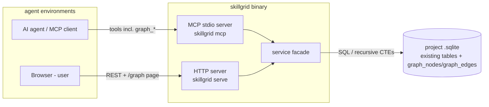
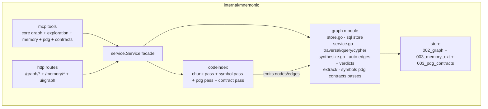

## Context

Mnemonic (`skillgrid-cli/internal/mnemonic/`) is a local-first memory engine: a per-project
SQLite store with `sessions`/`observations` (memory), `files`/`chunks` (code index),
`web_cache` (research snapshots), FTS5 search, an MCP stdio server (`mem_*`, `code_*`,
`web_*` tools), and an HTTP API with an embedded viewer plus Swagger UI.

This design adds a **graph layer** to Mnemonic — GitNexus-style structural depth
(callers/callees, impact, trace, context) and the cross-entity knowledge graph GitNexus
lacks (observations ↔ code ↔ web sources).

Reference points:

- **GitNexus** (abhigyanpatwari/GitNexus): property graph — `File`/`Function`/`Class`/
  `Process` nodes, single `CodeRelation` edge table with typed edges
  (`CALLS`, `IMPORTS`, `EXTENDS`, `STEP_IN_PROCESS`, …); MCP tools `query`/`context`/
  `impact`/`trace`; web UI built on **Sigma.js + graphology** (WebGL) with
  force-atlas2 layout, vendored React stack.
- **Mnemonic constraints**: single Go binary, `modernc.org/sqlite` (pure-Go, no cgo in
  the runtime path), embedded static assets for the UI, additive migrations only,
  existing tools/routes never renamed.

## Goals / Non-Goals

**Goals:**

- Property graph in *separate tables* (`graph_nodes`, `graph_edges`) alongside existing
  tables; existing stores remain the source of truth for row content
- Cross-entity graph: session/observation/file/symbol/web_entry nodes with typed edges,
  extended with `basic_block`/`route`/`tool`/`shape` for PDG and API-contract reads
- GitNexus capability parity (offline, computed at index time): core graph tools
  (`graph_nodes`, `graph_context`, `graph_impact`, `graph_trace`, `graph_status`,
  `graph_slink`), exploration/analysis tools (`list_repos`, `check`, `rename`,
  `detect_changes`, `cypher`), memory tools (Engram parity), taint/PDG tools
  (`explain`, `pdg_query`), and API-contract tools (`route_map`, `tool_map`,
  `shape_check`, `api_impact`)
- High-level tools first; recursive-CTE traversal (neighbors, blast radius, shortest
  path) — no external graph engine; a documented mini-Cypher subset over the same store
- Multi-language symbol pipeline (phase 2): Go, TypeScript, Python
  (function/method/type extraction + `DEFINES`/`CALLS`/`IMPORTS`/`EXTENDS` edges),
  opt-in via `config.d/indexing.yaml`
- PDG/taint pass (phase 3, opt-in): per-function blocks with CFG/CDG/reaching-defs,
  source/sink/sanitizer edges, and precomputed taint paths (intra- then
  interprocedural)
- API-contract pass (phase 4, opt-in): route/tool/response-shape nodes with consumer
  edges for HTTP/REST and MCP/RPC surface
- Memory extensions: `user_prompts` table, `mem_save_prompt`, `mem_review` +
  `review_after`, and memory tools (Engram parity subset)
- Visualization at `/graph` (Sigma.js + graphology, embedded, offline) matching
  gitnexus-web's rendering approach
- Incremental, deterministic, idempotent: re-indexing a file regenerates its
  pass-specific edges; upserts are unique-keyed

**Non-Goals:**

- A full Cypher evaluator — the `cypher` tool exposes a **limited subset**
  (single-pattern `MATCH` over node labels and edge types with `WHERE` on known
  properties, `RETURN` with aggregation); complex Cypher features (variable-length
  paths, list operations, UNION/MERGE) are NOT supported; `cypher` returns a
  structured error when the input is outside the subset
- Full type-checked cross-file call resolution (best-effort identifier matching,
  documented)
- Vector/semantic edges, auto-relationship ML, community detection (Leiden)
- Multi-project (cross-database) traversal
- Modifying existing `observations`/`files`/`web_cache`/`sessions` schemas
- Multi-language expansion beyond Go/TypeScript/Python in the first release
- Cross-language (polyglot) taint analysis — taint is per-language, per-function

## Decisions

### 1. Property graph in SQLite tables over existing stores (not a graph DB)

**Decision:** Two new tables, `graph_nodes` (kind + pointer into source tables + free
props) and `graph_edges` (typed, unique on (source, target, type)), plus FTS over node
names. Traversal via recursive CTEs with depth and fan-out caps.

**Alternatives considered:**

- Embedded graph engine (Kuzu/Bonsai, or an in-process property-graph library) — rejected:
  a second query engine to embed, migrate, and test for a workload (bounded fan-out
  traversals, subgraph extraction) that SQLite CTEs handle; breaks the single-engine story
- JSON-in-a-column graph — rejected: unqueryable traversal, no indexable edge types
- A second `.sqlite` file per project — rejected: cross-store joins (observation→file→
  symbol) become cross-database; one file + migrations stays simpler

**Rationale:** The graph is a *link layer*; source rows remain canonical for content.
Reads join back to source tables for details. `ref_table`/`ref_id` make nodes auditable and
cheap to rebuild.

### 2. Symbol pipeline inside codeindex, multi-language, gated by config

**Decision:** Phase 2 runs inside the existing incremental indexer flow: after the chunk
pass, per newly-indexed file, extract symbols (functions, methods, types) via
`smacker/go-tree-sitter` grammars (go, typescript, python), upsert `symbol` nodes, delete-
and-regenerate that file's pass-specific edges. Config:

```yaml
symbols:
  enabled: true                          # default in config.d/indexing.yaml once phase 2 ships
  languages: [go, typescript, python]    # grammar availability gates at build time
  max_calls_per_file: 500

pdg:        # phase 3
  enabled: false
  languages: [go, typescript, python]
  max_blocks: 400
  taint: { sources: [param, env, db, http, network], sinks: [exec, sql, net_write, html] }

contracts:  # phase 4
  enabled: false
  languages: [go, typescript, python]
  frameworks: [http, mcp]
```

**Language coupling:** PDG and contracts build on symbol nodes, so symbol extraction
must cover the same language set as the passes that consume it — the `extractor`
interface is language-parametrized, and per-language failures are isolated (one broken
grammar file never blocks other files).

**Cross-file resolution:** best-effort — same-file resolution is exact; repo-wide calls
match by symbol name within the project's symbol set (qualified name preferred). Inaccurate
edges are *extra*, never missing, and are cheap to regenerate.

**Alternatives considered:**

- Go-only first, TS/Python later — rejected: taint and shape parity across the languages
  this repo and typical agent targets actually contain is the point of "full parity";
  the extractor interface makes adding languages later cheap either way
- Separate `skillgrid symbols` command — rejected: a second index lifecycle to keep warm
  (the stale-index problem is already solved by codeindex incrementals)
- cgo tree-sitter bindings as runtime dep — mitigated: build-only gcc requirement,
  consistent with Go toolchains; the pure-Go runtime story is preserved (modernc sqlite
  unchanged)

**Rationale:** One incremental pipeline, one staleness model (`code_status`/`graph_status`
both report), reuse of include/exclude + file-size config.

### 3. Edge types are a fixed vocabulary (GitNexus-aligned + Mnemonic additions)

One exported constant set defines the full vocabulary; writer validation and the UI
legend both read it. Unknown types are rejected on write (keeps the UI legend and
impact-direction defaults meaningful). `edge_type` is indexed; direction is implied by
source/target (outgoing = depends-on/mentions; `CALLS` source=caller).

The set is grouped by layer; each group is produced by a specific pass, so the group
can be gated independently in config:

| Group | Edge types |
|---|---|
| Core (phase 1–2) | `CONTAINS`, `DEFINES`, `CALLS`, `IMPORTS`, `EXTENDS`, `MENTIONS`, `CITES`, `RELATED_TO`, `FOLLOWS_FROM` |
| Verdicts (phase 1) | `CONFLICTS_WITH`, `SUPERSEDES` |
| PDG/taint (phase 3) | `CFG`, `CDG`, `REACHING_DEF`, `SOURCE`, `SINK`, `SANITIZES`, `TAINTED`, `TAINT_PATH` |
| API-contracts (phase 4) | `HANDLES_ROUTE`, `FETCHES`, `ENTRY_POINT_OF`, `HANDLES_TOOL`, `DEFINES_ROUTE`, `CONSUMES_PROP` |

Verdict edges (`related`/`compatible`/`scoped` collapse to `RELATED_TO` with a `verdict`
prop; `not_conflict` is an edge *deletion*; `conflicts_with`/`supersedes` map to their
dedicated types) — this folds Engram's `mem_judge` conflict layer into the graph with no
separate `memory_relations` table.

### 4. Impact & trace semantics (depth-capped recursive CTEs)

- `impact(node, direction)` — `downstream`: nodes reachable via outgoing edges (what
  depends on it, by type: callers of a symbol via reverse CALLS, references for a
  file); `upstream`: incoming edges (what it calls/references). Returns hops + path
  length; cap depth (default 4, max 8) and max nodes (default 100).
- `trace(from, to)` — shortest directed path over a requested edge-type set; BFS via
  recursive CTE; cap explored nodes (default 1000).
- These mirror GitNexus `impact`/`trace` tool contracts (node list + risk-ish
  annotations = edge-type mix + hop depth), not Cypher.

### 5. Visualization: Sigma.js + graphology embedded (gitnexus-web stack)

- Single page `/graph` in the existing serve UI; vendored `sigma` + `graphology` +
  layout-forceatlas2 (no React — plain JS bootstrap, same embed pattern as the current
  viewer and swaggo-style swagger-ui assets)
- `GET /graph/subgraph` returns one `{nodes, edges}` payload (Sigma-ready); filters via
  query params (`kinds`, `edge_types`, `max_nodes`, `around=<node>`); node click →
  existing JSON endpoints for detail
- No build step in the Go repo: JS is handwritten against the vendored UMD bundles, so
  `go:embed ui` keeps working unchanged

**Alternatives considered:**

- React + Vite app (gitnexus-web literally) — rejected for a single embedded page: build
  machinery inside a Go repo, larger surface
- D3 force layout — rejected: SVG scaling vs Sigma WebGL; gitnexus-web chose Sigma for a
  reason

### 6. Auto-synthesis is deterministic and rebuildable

Phase 1 links are derived from existing rows on a schedule, not event-sourced:

- `CONTAINS`: session → its observations (`observations.session_id`)
- `MENTIONS`: observation → file tokens (path-like tokens in title/content matched to
  indexed `files.path`)
- `CITES`: observation → web_entry (URL or entry id present in content)
- `FOLLOWS_FROM`: session → previous session of the same project (by `started_at`)
- `DEFINES`/`CALLS`/… : symbol pipeline only

Edges carry `properties_json.source = "auto"|"manual"`; rebuilds delete auto-edges for a
domain then reinsert, so manual links survive re-index. `graph_slink` writes manual edges
only.

### 7. PDG / taint pass — precompute flows at index time (GitNexus `--pdg` analog)

**Decision:** Phase 3 is a per-function analysis pass inside codeindex. For each function
symbol (any of go/ts/python), it:

1. Walks the tree-sitter body and emits `basic_block` nodes in control order (props:
   `symbol_id`, `start_line`, `end_line`, `stmt_summary`), linked by `CFG` edges
   (block→block control) and `CDG` edges (block→block data dependence, derived from
   local def/use).
2. Marks `SOURCE` / `SINK` nodes on the relevant blocks using the configured source/sink
   classes; emits `SANITIZES` edges where a sanitizer function is called between a
   source and a sink.
3. Computes a **restricted taint** graph: intra-procedural dataflow within each function,
   then **interprocedural mending** across CALLS edges (a source in the callee can taint
   the caller's use site if the callee returns the tainted value). Precomputes
   `TAINT_PATH` edges (source→sink) with a `confidence` and `via_symbols` prop so the
   `explain` tool is a single JSON read.

All of this is *persisted to the graph at index time* — exactly GitNexus's "precomputed
relational intelligence" — so `explain`/`pdg_query` are **reads**, not on-demand analyses.

**Config gate:** `pdg.enabled` (default false in `config.d/indexing.yaml`; the pass is
opt-in per project).

**Alternatives considered:**

- On-demand (parse at query time) — rejected: violates the precompute story; a 200-node
  graph with taint queries would pay the parse cost per query
- LadybugDB or an embedded graph DB for the dataflow edges — rejected: SQLite CTEs handle
  bounded fan-out fine; the pass *emits* edges into the same tables
- Full SSA / whole-program dataflow — rejected: overkill for the store's use case; the
  heuristic source/sink + intra-then-inter approach covers the agent's real questions
  ("what reaches this SQL/exec/net write?")

**Accuracy stance:** findings are *candidates*, not proofs — `explain` returns the
precomputed path + sanitizer list + confidence so the agent can adjudicate. This is the
same stance GitNexus holds for `explain`/`pdg_query` (they're "read persisted findings
from an index built with `--pdg`", not a theorem prover).

**Rationale:** one precompute pass, two cheap read tools, no new runtime dependency.

### 8. API-contract pass — route/tool/shape extraction

**Decision:** Phase 4 extracts the API surface of the indexed code:

1. **Route nodes** — framework route-registration patterns (Go: `http.HandleFunc` /
   `mux.HandleFunc`; TS/Node: `app.get/post/...`; Python/Flask-FastAPI:
   `@app.route` / `@router.get`). Props: `method`, `path`, `handler_symbol`, `framework`.
2. **Tool nodes** — MCP/RPC tool definitions (Go: `mcplib.NewTool("name")`; TS:
   `defineTool` / `ToolServer.tool`; Python: `@mcp.tool`). Props: `name`, `framework`,
   `handler_symbol`.
3. **Shape nodes** — provider response fields (inferred from the handler's return
   expression: struct literal fields, `map[string]any` keys, JSON tag set). One shape
   node *per provider route* (1:1 with the route, not per consumer, so `shape_check` is
   a single node-pair join).
4. **Consumer edges** — `FETCHES` (consumer→provider route), `HANDLES_TOOL` (MCP
   server→tool), `HANDLES_ROUTE` (server→route), `CONSUMES_PROP` (consumer→shape prop),
   `ENTRY_POINT_OF` (route→entry symbol).

**Config gate:** `contracts.enabled` (opt-in). `contracts.frameworks` controls which
patterns are scanned (default `[http, mcp]`).

**Alternatives considered:**

- A full "HTTP semantic extraction" (runtime introspection, middleware-aware) — rejected:
  too heavy for an index-time, offline pass; pattern extraction covers the real use case
  (which component calls which endpoint, and which fields it reads)
- Storing response shapes as props on the route — rejected: `shape_check` is a *diff
  against consumers*; a shape node is the join key

**Accuracy stance:** shape inference depends on how explicit the return is; `shape_check`
always reports the diff (matched / missing / extra fields per consumer) — it never
silently "passes".

### 9. `cypher` — a bounded mini-Cypher subset, not a full evaluator

**Decision:** The `cypher` tool accepts a **limited, documented** subset:

- Single `MATCH (a:Label1 ...)-(r:EdgeType)->(b:Label2)` pattern (one path, ≥1 edge)
- `WHERE` on any node/edge property (equality, `CONTAINS`, `IN`) — no property lists,
  no regex, no functions beyond a tiny whitelist (`lower`, `upper`, `toString`)
- `RETURN a, b, r` (any subset) — no aggregation, no `collect`, no `ORDER BY` (the
  response is always JSON, so ordering is client-side)

Anything else (variable-length `*1..3`, `OPTIONAL MATCH`, `MERGE`, `UNION`, `WITH`,
`CREATE`) returns a structured error: `"cypher feature unsupported: <feature>"` plus a
list of the supported subset so the agent can fall back to `graph_nodes`/`graph_trace`.

The subset is compiled to recursive CTEs over `graph_nodes`/`graph_edges` (same store,
same caps), so no new engine is introduced.

**Alternatives considered:**

- Full Cypher evaluator — rejected: writing a real Cypher parser/evaluator on top of
  SQLite is an order-of-magnitude larger surface than the graph itself
- Push Cypher fully to Sigma.js / the UI — rejected: the point of `cypher` is an MCP
  tool, not a UI affordance
- No `cypher` at all (keep as a non-goal) — rejected: it's one of the 17 tools in the
  parity target; the bounded subset captures the high-value use (ad-hoc pattern matching
  across node kinds) without the full parser

### 10. Exploration & analysis tools

- **`list_repos`** — lists all project stores with `graph_size` (node/edge counts) and
  staleness. This is the MCP version of `GET /projects` and enables the multi-project
  surface without a `project`-parameter plumbing change.
- **`check`** — structural sanity report: nodes with zero edges (orphans), symbols
  without `DEFINES` (broken extraction), stale-flag on any pass, edge-type distribution
  histogram. Read-only.
- **`rename`** — *read-only planner* (not a mutator): for a symbol, returns all affected
  locations — same-file call sites, cross-file `CALLS` edges, files that `MENTIONS` the
  name — ranked by relevance so the agent can execute the rename with confidence.
- **`detect_changes`** — maps a git diff (working tree or `since=<ref>`) to:
  changed files → touched symbols → downstream impact (over the graph) + observations
  that `MENTIONS` the changed files.

All four are *reads* over the graph + git; no new storage.

### 11. Memory tools (Engram parity subset)

- **`mem_timeline`** — chronological context around an observation (`before`/`after`
  windows via `created_at` ordering). Read-only.
- **`mem_stats`** — aggregate counts: observations by type/scope, sessions (active/
  ended), web cache totals, graph size (node/edge by kind). Read-only.
- **`mem_doctor`** — store health: schema version, FTS integrity (row counts vs. FTS
  counts), WAL state, last error, disk size.
- **`mem_current_project`** — project-resolution result + available projects. This is
  the "call this first" tool of the Engram MCP; it returns the *detection* result so
  the agent can verify its scope.
- **`mem_update`** — field update on an observation (title/content/type/scope/topic_key)
  with `updated_at` bump + FTS resync.
- **`mem_delete`** — soft delete (default, sets `deleted_at`) / hard delete
  (`hard_delete=true`) — respects the existing `deleted_at` column; cascades: FTS row
  removed, auto-edges removed, manual edges preserved.
- **`mem_save_prompt`** — store user prompts (new `user_prompts` table + FTS). Feeds
  `mem_search`'s prompt context so future sessions can recall what was asked.
- **`mem_capture_passive`** — deterministic extraction into observations from a free
  text block (structured, no LLM round-trip).
- **`mem_review`** — list observations due for review (`review_after` column, per-
  observation timestamp; `NULL` = never due).
- **`graph_judge`** — store a relationship verdict between two observations
  (`related`|`compatible`|`scoped`|`conflicts_with`|`supersedes`|`not_conflict`) as a
  typed edge + confidence/reason props — this **folds Engram's `mem_judge`/`mem_compare`
  conflict layer into the graph** (no separate `memory_relations` table; verdicts ARE
  graph edges).

## Architecture

### Container (skillgrid single binary, unchanged boundary)



### Component (graph module inside internal/mnemonic)



### Node & edge model

| Node kind | Source of truth | Node fields |
|---|---|---|
| `session` | `sessions` | ref_table/ref_id → `sessions.id` |
| `observation` | `observations` | ref_table/ref_id → `observations.id` |
| `file` | `files` | ref_table/ref_id → `files.id`, props: `path` |
| `symbol` | derived (graph-owned) | props: `path`, `name`, `kind` (function/method/type), `start_line`, `end_line`, `signature?`, `language` |
| `web_entry` | `web_cache` | ref_table/ref_id → `web_cache.id`, props: `url`, `source` |
| `basic_block` | derived (PDG) | props: `symbol_id`, `start_line`, `end_line`, `stmt_kind` |
| `route` | derived (contracts) | props: `method`, `path`, `framework`, `handler_symbol`, `file_path` |
| `tool` | derived (contracts) | props: `name`, `framework`, `handler_symbol`, `file_path` |
| `shape` | derived (contracts) | props: `route_ref`, `fields` (JSON array of field names), `source_symbol` |

The edge set (decision 3) is grouped by layer; each group is produced by a specific
pass and each pass can be gated independently in `config.d/indexing.yaml`.

Schema (migrations `002_graph.sql` + `003_pdg_contracts.sql`, both additive):

```sql
-- 002_graph.sql (unchanged from phase 1)
CREATE TABLE IF NOT EXISTS graph_nodes (
    id INTEGER PRIMARY KEY AUTOINCREMENT,
    project TEXT NOT NULL,
    kind TEXT NOT NULL,            -- session|observation|file|symbol|web_entry|basic_block|route|tool|shape
    ref_table TEXT,                -- sessions|observations|files||web_cache (NULL for derived kinds)
    ref_id INTEGER,
    name TEXT NOT NULL,
    properties_json TEXT NOT NULL DEFAULT '{}',
    created_at TEXT NOT NULL,
    UNIQUE(project, kind, ref_table, ref_id, name)
);
CREATE TABLE IF NOT EXISTS graph_edges (
    id INTEGER PRIMARY KEY AUTOINCREMENT,
    project TEXT NOT NULL,
    source_id INTEGER NOT NULL REFERENCES graph_nodes(id) ON DELETE CASCADE,
    target_id INTEGER NOT NULL REFERENCES graph_nodes(id) ON DELETE CASCADE,
    edge_type TEXT NOT NULL,       -- see decision 3 vocabulary
    properties_json TEXT NOT NULL DEFAULT '{}',
    weight REAL NOT NULL DEFAULT 1,
    created_at TEXT NOT NULL,
    pass TEXT NOT NULL,            -- symbols|pdg|contracts|synthesis|manual
    UNIQUE(source_id, target_id, edge_type)
);
CREATE INDEX IF NOT EXISTS idx_graph_edges_source ON graph_edges(source_id, edge_type);
CREATE INDEX IF NOT EXISTS idx_graph_edges_target ON graph_edges(target_id, edge_type);
CREATE INDEX IF NOT EXISTS idx_graph_edges_pass ON graph_edges(project, pass);
CREATE INDEX IF NOT EXISTS idx_graph_nodes_kind ON graph_nodes(project, kind);
CREATE VIRTUAL TABLE IF NOT EXISTS graph_nodes_fts USING fts5(
    name, properties_json, tokenize='porter'
);

-- 003_pdg_contracts.sql (additive; adds the derived node kinds' index)
CREATE INDEX IF NOT EXISTS idx_graph_nodes_symbol_ref
  ON graph_nodes(project, kind, ref_id) WHERE kind IN ('basic_block','route','tool','shape');

-- 003_memory_ext.sql: user_prompts table
CREATE TABLE IF NOT EXISTS user_prompts (
    id INTEGER PRIMARY KEY AUTOINCREMENT,
    project TEXT NOT NULL,
    session_id TEXT REFERENCES sessions(id) ON DELETE SET NULL,
    content TEXT NOT NULL,
    created_at TEXT NOT NULL
);
CREATE INDEX IF NOT EXISTS idx_user_prompts_project ON user_prompts(project, created_at);
CREATE VIRTUAL TABLE IF NOT EXISTS prompts_fts USING fts5(
    content, tokenize='porter',
    content='user_prompts', content_rowid='id'
);

ALTER TABLE observations ADD COLUMN review_after TEXT;
CREATE INDEX IF NOT EXISTS idx_observations_review
  ON observations(project, review_after) WHERE review_after IS NOT NULL;
```

FTS sync triggers mirror the existing `observations_fts` pattern. The `pass` column on
`graph_edges` is the rebuild unit: each extraction pass deletes `WHERE pass = 'pdg'`
(rows it owns) and reinserts, so manual edges and other passes are never touched.

## API surface

### MCP tools (new, 27 tools across five groups)

**Core graph** (GitNexus analog, `graph_*` namespace)

| Tool | Behavior |
|---|---|
| `graph_slink` | Add/remove a typed manual edge between two nodes by ref (`{from:{kind,id}, to:{kind,id}, type}`); `remove=true` deletes it |
| `graph_nodes` | FTS node search + kind filter + degree ranking (`query` analog) |
| `graph_context` | Node + N-hop neighbors with edge labels and source-row summaries (`context` analog) |
| `graph_impact` | Upstream/downstream reachable set, hop depths, edge-type mix (`impact` analog) |
| `graph_trace` | Shortest directed path between two nodes over given edge types (`trace` analog) |
| `graph_status` | Node/edge counts by kind/type/pass, per-pass freshness, stale flag, extraction errors |

**Exploration & analysis** (GitNexus per-repo, no new storage)

| Tool | Behavior |
|---|---|
| `list_repos` | All project stores with graph size + staleness (MCP analog of `GET /projects`) |
| `check` | Structural sanity: orphan nodes, symbols without `DEFINES`, edge-type histogram, per-pass staleness |
| `rename` | Read-only planner: all affected locations for a symbol (same-file call sites, cross-file `CALLS`, `MENTIONS` files), ranked |
| `detect_changes` | Map a git diff → touched symbols → downstream impact + observations that mention the changed files |
| `cypher` | Bounded mini-Cypher subset (see decision 9); structured error + supported-subset list on unsupported features |

**Memory** (Engram parity subset)

| Tool | Behavior |
|---|---|
| `mem_timeline` | Chronological context around an observation (`before`/`after` windows) |
| `mem_stats` | Observations/sessions/web/graph aggregate counts |
| `mem_doctor` | Store health: schema version, FTS integrity, WAL, last error, disk size |
| `mem_current_project` | Project-resolution result + available projects ("call this first" tool) |
| `mem_update` | Field update on an observation with `updated_at` bump + FTS resync |
| `mem_delete` | Soft (default) / hard delete; cascades FTS + auto-edges, preserves manual edges |
| `mem_save_prompt` | Store a user prompt (`user_prompts` table + FTS) |
| `mem_capture_passive` | Deterministic structured extraction into an observation from a text block |
| `mem_review` | List observations due for review (`review_after < now`) |
| `graph_judge` | Store a relationship verdict between two observations as a typed graph edge (folds `mem_judge`/`mem_compare`) |

**PDG / taint** (phase 3, opt-in)

| Tool | Behavior |
|---|---|
| `explain` | One taint finding → persisted `TAINT_PATH`, block steps, sanitizers, confidence (`explain` analog) |
| `pdg_query` | Function CFG/CDG/reaching-def view, optional `from`/`to` blocks, `type` filter (`pdg_query` analog) |

**API contracts** (phase 4, opt-in)

| Tool | Behavior |
|---|---|
| `route_map` | Routes → handlers → fetchers grouped by framework, with entry points (`route_map` analog) |
| `tool_map` | MCP/RPC tools → definition + handler + callers (`tool_map` analog) |
| `shape_check` | Provider `shape` vs consumers' `CONSUMES_PROP` → matched/missing/extra fields, per route (`shape_check` analog) |
| `api_impact` | Pre-change impact of a route handler over the contract subgraph (`api_impact` analog) |

All return raw JSON (OCBI convention) through the existing `JSONResult` wrapper.

### HTTP routes (serve)

| Route | Purpose |
|---|---|
| `GET /graph/subgraph?project=&kinds=&edge_types=&around=&max=200` | Sigma-ready `{nodes,edges}` payload; `around` anchors the extraction at a node's neighborhood (depth 2) and `max` caps total nodes |
| `GET /graph/node/{id}` | Node + joined source-row content |
| `GET /graph/node/{id}/neighbors?depth=&types=` | Neighbor walk |
| `GET /graph/impact/{id}?direction=&depth=` | Blast radius |
| `GET /graph/trace?from=&to=&types=` | Shortest path |
| `POST /graph/link` | Manual edge upsert (same auth as other POST routes) |
| `GET /graph/status` | Stats |
| `GET /graph/check` | Structural sanity report |
| `GET /graph/rename?symbol_id=` | Rename planner (affected locations) |
| `GET /graph/detect-changes?since=` | Diff → symbol → impact mapping |
| `POST /graph/cypher` | Mini-Cypher evaluation (same auth as `POST /graph/link`) |
| `GET /graph/taint/{symbol_id}` | Taint findings for a symbol |
| `GET /graph/pdg/{symbol_id}?type=&from=&to=` | CFG/CDG/reaching-def view |
| `GET /graph/routes?framework=` | Route map |
| `GET /graph/tools?framework=` | Tool map |
| `GET /graph/shapes/{route_id}` | Provider shape + consumer diff |
| `GET /graph/api-impact/{route_id}` | API handler impact |
| `GET /graph` | Visualizer page (embedded) |
| `GET /memory/prompts/recent?project=&limit=` | Recent user prompts |
| `POST /memory/prompts` | Save a user prompt (same auth as other POST routes) |
| `GET /memory/timeline?observation_id=&before=&after=` | Chronological context |
| `GET /memory/stats?project=` | Aggregate counts |
| `GET /memory/doctor?project=` | Store health |
| `GET /memory/current-project` | Project resolution result |
| `PATCH /memory/observations/{id}` | Update an observation |
| `DELETE /memory/observations/{id}?hard=` | Delete (soft default) |
| `GET /memory/review?project=&limit=` | Observations due for review |
| `POST /memory/review/mark` | Reset an observation's review cycle (advance `review_after`) |
| `POST /memory/capture-passive` | Extract an observation from a text block |
| `POST /graph/judge` | Store a relationship verdict as a typed edge |

## Error handling

- Unknown node refs → `404 {"error": "node not found: observation#123"}`; tools return the
  same via `JSONResult`-wrapped error text object
- Traversal caps exhausted → result includes `"truncated": true` (no error)
- Symbol pipeline failure for one file → skipped + reported in `graph_status`
  (`errors: [{path, reason}]`); index pass still succeeds
- Cyclic path in `trace` BFS → cycle guard in CTE (`path NOT LIKE` on node id)
- Manual link with unknown edge type → `400` listing the vocabulary

## Testing

Per existing conventions (httptest + seeded stores, no mocks of the store):

1. **Store**: upsert idempotency (same (kind, ref, name) → 1 row; edge re-add → 1 edge),
   FTS sync under insert/update/delete, referential delete of edges on node delete,
   `pass`-scoped delete (only the owning pass's edges removed), `user_prompts` + FTS,
   `review_after` index
2. **Service (traversal)**: fixture graph (diamond + cycle) — `Neighbors` hop set,
   `Impact` direction + hop depths, `ShortestPath` correctness + cycle guard,
   `Subgraph` caps, search ranking
3. **Symbols (multi-language)**: one fixture per language (Go, TS, Python) with
   package-internal call + cross-file call + type embedding — exact expected node set
   and edge set per language; incremental re-index regenerates only the changed file's
   edges; config off → no symbol nodes for that language; per-file extraction failure
   isolated from other files
4. **Synthesis**: seeded session/observation/file/web rows → exact expected auto-edge
   set; manual edges survive rebuild (delete-auto-then-insert); `graph_judge` verdict
   writes the right edge type and `not_conflict` deletes it
5. **PDG / taint**: a fixture function with a known source→sink chain and a sanitizer
   — exact `CFG`/`CDG`/`REACHING_DEF`/`SOURCE`/`SINK`/`SANITIZES`/`TAINT_PATH` sets;
   `explain` returns the finding with path + sanitizer + confidence; interprocedural
   case (callee returns tainted value) produces a cross-function `TAINT_PATH`;
   `pdg_query` returns the block/CFG/CDG subset correctly; `pdg.enabled=false` → no
   `basic_block` nodes
6. **API contracts**: a fixture with 2 routes (Go + TS) + 1 MCP tool + a consumer that
   fetches a route and reads one field — exact `route`/`tool`/`shape` nodes and
   `HANDLES_ROUTE`/`FETCHES`/`HANDLES_TOOL`/`CONSUMES_PROP`/`ENTRY_POINT_OF`/
   `DEFINES_ROUTE` edges; `route_map`/`tool_map` group correctly; `shape_check` flags a
   missing field; `api_impact` returns the downstream consumer set; `contracts.enabled=false
   → no route/tool/shape nodes`
7. **Cypher**: the supported subset returns the right node/edge sets; each unsupported
   feature (variable-length, `OPTIONAL MATCH`, `MERGE`, aggregation) returns the
   structured "feature unsupported" error + supported-subset list
8. **Transport**: MCP tool JSON contract (one happy-path call per tool, 27 tools),
   HTTP routes 200 + payload shape, auth on all `POST`/`PATCH`/`DELETE` memory+graph
   write routes (token set), `/graph` page + assets return 200
9. **Build gate**: `go build && go vet && go test ./...` per phase
   (matches Taskfile `test`)

## Risks / Trade-offs

- **cgo build for tree-sitter grammars (go/ts/python)** → build-only requirement (gcc
  documented in `docs/13-mnemonic.md`; no runtime cgo); per-grammar availability gates
  keep the build green if one grammar is unavailable
- **Best-effort cross-file call resolution** → documented non-goal-level accuracy; edges
  are cheap to regenerate; `trace` on CALLS may include false edges, never miss same-file
  ones
- **PDG/taint false positives** → the classic interprocedural dataflow cost; findings are
  labeled `candidate` with `confidence` + sanitizers + the path so the agent can dismiss;
  `explain` never claims a proof
- **API shape inference precision** → depends on explicitness of the return expression;
  `shape_check` always reports the diff (matched/missing/extra) and never silently
  passes
- **`cypher` subset is small** → returns a structured "feature unsupported" error + the
  supported-subset list; the high-value use (ad-hoc pattern matching) is covered; full
  Cypher stays a documented non-goal
- **Multilingual surface area** → three grammars multiply the parser/extraction test
  matrix; isolated per-language fixtures + per-file failure isolation bound the blast
  radius
- **Recursive CTE blow-up on dense graphs** → depth/fanout/node caps enforced in SQL;
  caps surfaced as `truncated`
- **Embed size (+~1.5–2 MB for sigma+graphology assets)** → acceptable, matches existing
  swagger-ui embed pattern; lazy-loaded from `/graph` only
- **Two places to update edge vocabulary (writer validation + UI legend)** → single
  Go constant set exported; UI fetches vocabulary from `GET /graph/status`
- **`graph_status` vs `code_status` overlap** → `graph_status` adds node/edge counts by
  pass + per-pass freshness; `code_status` unchanged (chunk-level staleness)
- **27 new tools** → tool-description quality is the agent's entry point; each tool has a
  one-line "what + when to use" description, grouped in help output

## Migration Plan

1. `002_graph.sql` applies on next `store.Open` — old DBs work unchanged; no data move
2. Phase 1 (store + synthesis + core graph + exploration + memory tools + viz) ships
   usable alone: file/observation/web graph + memory surface visible immediately after
   first `mem_save`/index
3. Phase 2 (symbols, go/ts/python) lands behind `symbols.enabled`; enabling re-runs
   `code_index`/`skillgrid index` to backfill symbols for already-indexed files
4. Phase 3 (PDG/taint) lands behind `pdg.enabled`; same incremental backfill for
   function bodies
5. Phase 4 (contracts) lands behind `contracts.enabled`; same incremental backfill for
   route/tool/shape extraction
6. `003_memory_ext.sql` (+ `user_prompts`) and `003_pdg_contracts.sql` apply
   additively; old DBs work unchanged
7. Rollback: drop the phase's tools (feature-gated routes can 404); graph/pdg/contract
   nodes are additive and can be deleted without touching original tables;
   `user_prompts`/`review_after` are additive and independently droppable

## Open Questions

None blocking. Deferred (post-release candidates): additional languages (Java/Rust/C++),
community detection (`Community` nodes, Leiden), `Process`-style execution flow
tracing, cross-project traversal, full Cypher (variable-length paths, `MERGE`,
aggregation), whole-program (inter-procedural) taint beyond the callee-returns
mending, runtime HTTP semantic extraction.
