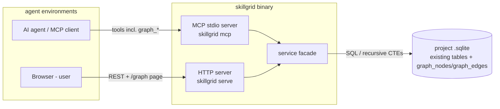
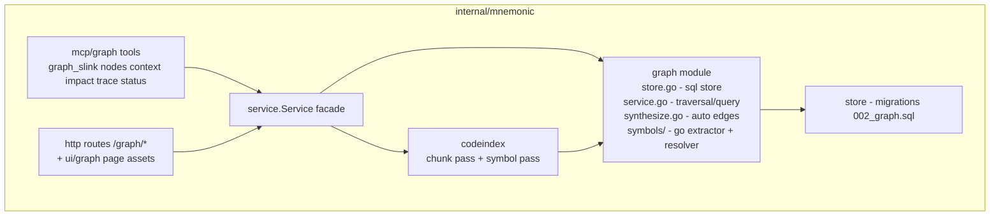

## Context

Mnemonic (`skillgrid-cli/internal/mnemonic/`) is a local-first memory engine: a per-project
SQLite store with `sessions`/`observations` (memory), `files`/`chunks` (code index),
`web_cache` (research snapshots), FTS5 search, an MCP stdio server (`mem_*`, `code_*`,
`web_*` tools), and an HTTP API with an embedded viewer plus Swagger UI.

This design adds a **graph layer** to Mnemonic — GitNexus-style structural depth
(callers/callees, impact, trace, context) and the cross-entity knowledge graph GitNexus
lacks (observations ↔ code ↔ web sources).

Reference points:

- **GitNexus** (abhigyanpatwari/GitNexus): property graph — `File`/`Function`/`Class`/
  `Process` nodes, single `CodeRelation` edge table with typed edges
  (`CALLS`, `IMPORTS`, `EXTENDS`, `STEP_IN_PROCESS`, …); MCP tools `query`/`context`/
  `impact`/`trace`; web UI built on **Sigma.js + graphology** (WebGL) with
  force-atlas2 layout, vendored React stack.
- **Mnemonic constraints**: single Go binary, `modernc.org/sqlite` (pure-Go, no cgo in
  the runtime path), embedded static assets for the UI, additive migrations only,
  existing tools/routes never renamed.

## Goals / Non-Goals

**Goals:**

- Property graph in *separate tables* (`graph_nodes`, `graph_edges`) alongside existing
  tables; existing stores remain the source of truth for row content
- Cross-entity graph: session/observation/file/symbol/web_entry nodes with typed edges
- GitNexus-analog query tools: `graph_nodes`, `graph_context`, `graph_impact`,
  `graph_trace`, `graph_status`, `graph_slink`
- High-level tools first; recursive-CTE traversal (neighbors, blast radius, shortest
  path) — no external graph engine
- Go symbol pipeline (phase 2): function/method/type extraction + `DEFINES`/`CALLS`/
  `IMPORTS`/`EXTENDS` edges, opt-in via `config.d/indexing.yaml`
- Visualization at `/graph` (Sigma.js + graphology, embedded, offline) matching
  gitnexus-web's rendering approach
- Incremental, deterministic, idempotent: re-indexing a file regenerates its edges;
  upserts are unique-keyed

**Non-Goals:**

- Cypher query language (high-level tools cover the GitNexus analog set)
- Symbol extraction for languages other than Go in the first release
- Full type-checked cross-file call resolution (best-effort identifier matching,
  documented)
- Vector/semantic edges, auto-relationship ML, community detection (Leiden)
- Multi-project (cross-database) traversal
- Modifying existing `observations`/`files`/`web_cache`/`sessions` schemas

## Decisions

### 1. Property graph in SQLite tables over existing stores (not a graph DB)

**Decision:** Two new tables, `graph_nodes` (kind + pointer into source tables + free
props) and `graph_edges` (typed, unique on (source, target, type)), plus FTS over node
names. Traversal via recursive CTEs with depth and fan-out caps.

**Alternatives considered:**

- Embedded graph engine (Kuzu/Bonsai, or an in-process property-graph library) — rejected:
  a second query engine to embed, migrate, and test for a workload (bounded fan-out
  traversals, subgraph extraction) that SQLite CTEs handle; breaks the single-engine story
- JSON-in-a-column graph — rejected: unqueryable traversal, no indexable edge types
- A second `.sqlite` file per project — rejected: cross-store joins (observation→file→
  symbol) become cross-database; one file + migrations stays simpler

**Rationale:** The graph is a *link layer*; source rows remain canonical for content.
Reads join back to source tables for details. `ref_table`/`ref_id` make nodes auditable and
cheap to rebuild.

### 2. Symbol pipeline inside codeindex, gated by config

**Decision:** Phase 2 runs inside the existing incremental indexer flow: after the chunk
pass, per newly-indexed Go file, extract symbols (functions, methods, types) via
`smacker/go-tree-sitter`, upsert `symbol` nodes, delete-and-regenerate that file's
`DEFINES`/`CALLS`/`IMPORTS`/`EXTENDS` edges. Config:

```yaml
symbols:
  enabled: true          # default in config.d/indexing.yaml once phase 2 ships
  languages: [go]
  max_calls_per_file: 500
```

**Cross-file resolution:** best-effort — same-file resolution is exact; repo-wide calls
match by symbol name within the project's symbol set (qualified name preferred). Inaccurate
edges are *extra*, never missing, and are cheap to regenerate.

**Alternatives considered:**

- Separate `skillgrid symbols` command — rejected: a second index lifecycle to keep warm
  (the stale-index problem is already solved by codeindex incrementals)
- cgo tree-sitter bindings as runtime dep — mitigated: build-only gcc requirement,
  consistent with Go toolchains; the pure-Go runtime story is preserved (modernc sqlite
  unchanged)

**Rationale:** One incremental pipeline, one staleness model (`code_status`/`graph_status`
both report), reuse of include/exclude + file-size config.

### 3. Edge types are a fixed vocabulary (GitNexus-aligned + Mnemonic additions)

`CONTAINS`, `DEFINES`, `CALLS`, `IMPORTS`, `EXTENDS`, `MENTIONS`, `CITES`,
`RELATED_TO`, `FOLLOWS_FROM`. Unknown types are rejected on write (keeps the UI legend and
impact-direction defaults meaningful). `edge_type` is indexed; direction is implied by
source/target (outgoing = depends-on/mentions; `CALLS` source=caller).

### 4. Impact & trace semantics (depth-capped recursive CTEs)

- `impact(node, direction)` — `downstream`: nodes reachable via outgoing edges (what
  depends on it, by type: callers of a symbol via reverse CALLS, references for a
  file); `upstream`: incoming edges (what it calls/references). Returns hops + path
  length; cap depth (default 4, max 8) and max nodes (default 100).
- `trace(from, to)` — shortest directed path over a requested edge-type set; BFS via
  recursive CTE; cap explored nodes (default 1000).
- These mirror GitNexus `impact`/`trace` tool contracts (node list + risk-ish
  annotations = edge-type mix + hop depth), not Cypher.

### 5. Visualization: Sigma.js + graphology embedded (gitnexus-web stack)

- Single page `/graph` in the existing serve UI; vendored `sigma` + `graphology` +
  layout-forceatlas2 (no React — plain JS bootstrap, same embed pattern as the current
  viewer and swaggo-style swagger-ui assets)
- `GET /graph/subgraph` returns one `{nodes, edges}` payload (Sigma-ready); filters via
  query params (`kinds`, `edge_types`, `max_nodes`, `around=<node>`); node click →
  existing JSON endpoints for detail
- No build step in the Go repo: JS is handwritten against the vendored UMD bundles, so
  `go:embed ui` keeps working unchanged

**Alternatives considered:**

- React + Vite app (gitnexus-web literally) — rejected for a single embedded page: build
  machinery inside a Go repo, larger surface
- D3 force layout — rejected: SVG scaling vs Sigma WebGL; gitnexus-web chose Sigma for a
  reason

### 6. Auto-synthesis is deterministic and rebuildable

Phase 1 links are derived from existing rows on a schedule, not event-sourced:

- `CONTAINS`: session → its observations (`observations.session_id`)
- `MENTIONS`: observation → file tokens (path-like tokens in title/content matched to
  indexed `files.path`)
- `CITES`: observation → web_entry (URL or entry id present in content)
- `FOLLOWS_FROM`: session → previous session of the same project (by `started_at`)
- `DEFINES`/`CALLS`/… : symbol pipeline only

Edges carry `properties_json.source = "auto"|"manual"`; rebuilds delete auto-edges for a
domain then reinsert, so manual links survive re-index. `graph_slink` writes manual edges
only.

## Architecture

### Container (skillgrid single binary, unchanged boundary)



### Component (graph module inside internal/mnemonic)



### Node & edge model

| Node kind | Source of truth | Node fields |
|---|---|---|
| `session` | `sessions` | ref_table/ref_id → `sessions.id` |
| `observation` | `observations` | ref_table/ref_id → `observations.id` |
| `file` | `files` | ref_table/ref_id → `files.id`, props: `path` |
| `symbol` | derived (graph-owned) | props: `path`, `name`, `kind` (function/method/type), `start_line`, `end_line`, `signature?` |
| `web_entry` | `web_cache` | ref_table/ref_id → `web_cache.id`, props: `url`, `source` |

Schema (migration `002_graph.sql`, additive):

```sql
CREATE TABLE IF NOT EXISTS graph_nodes (
    id INTEGER PRIMARY KEY AUTOINCREMENT,
    project TEXT NOT NULL,
    kind TEXT NOT NULL,            -- session|observation|file|symbol|web_entry
    ref_table TEXT,                -- sessions|observations|files||web_cache
    ref_id INTEGER,
    name TEXT NOT NULL,
    properties_json TEXT NOT NULL DEFAULT '{}',
    created_at TEXT NOT NULL,
    UNIQUE(project, kind, ref_table, ref_id, name)
);
CREATE TABLE IF NOT EXISTS graph_edges (
    id INTEGER PRIMARY KEY AUTOINCREMENT,
    project TEXT NOT NULL,
    source_id INTEGER NOT NULL REFERENCES graph_nodes(id) ON DELETE CASCADE,
    target_id INTEGER NOT NULL REFERENCES graph_nodes(id) ON DELETE CASCADE,
    edge_type TEXT NOT NULL,       -- see decision 3 vocabulary
    properties_json TEXT NOT NULL DEFAULT '{}',
    weight REAL NOT NULL DEFAULT 1,
    created_at TEXT NOT NULL,
    UNIQUE(source_id, target_id, edge_type)
);
CREATE INDEX IF NOT EXISTS idx_graph_edges_source ON graph_edges(source_id, edge_type);
CREATE INDEX IF NOT EXISTS idx_graph_edges_target ON graph_edges(target_id, edge_type);
CREATE INDEX IF NOT EXISTS idx_graph_nodes_kind ON graph_nodes(project, kind);
CREATE VIRTUAL TABLE IF NOT EXISTS graph_nodes_fts USING fts5(
    name, properties_json, tokenize='porter'
);
```

FTS sync triggers mirror the existing `observations_fts` pattern.

## API surface

### MCP tools (new, `graph_*` namespace)

| Tool | Behavior (GitNexus analog) |
|---|---|
| `graph_slink` | Add/remove a typed manual edge between two nodes by ref (`{from:{kind,id}, to:{kind,id}, type}`); `remove=true` deletes it |
| `graph_nodes` | FTS node search + kind filter + degree ranking (`query` analog) |
| `graph_context` | Node + N-hop neighbors with edge labels and source-row summaries (`context` analog) |
| `graph_impact` | Upstream/downstream reachable set, hop depths, edge-type mix (`impact` analog) |
| `graph_trace` | Shortest directed path between two nodes over given edge types (`trace` analog) |
| `graph_status` | Node/edge counts by kind/type, symbol-pipeline freshness, stale flag |

All return raw JSON (OCBI convention) through the existing `JSONResult` wrapper.

### HTTP routes (serve)

| Route | Purpose |
|---|---|
| `GET /graph/subgraph?project=&kinds=&edge_types=&around=&max=200` | Sigma-ready `{nodes,edges}` payload; `around` anchors the extraction at a node's neighborhood (depth 2) and `max` caps total nodes |
| `GET /graph/node/{id}` | Node + joined source-row content |
| `GET /graph/node/{id}/neighbors?depth=&types=` | Neighbor walk |
| `GET /graph/impact/{id}?direction=&depth=` | Blast radius |
| `GET /graph/trace?from=&to=&types=` | Shortest path |
| `POST /graph/link` | Manual edge upsert (same auth as other POST routes) |
| `GET /graph/status` | Stats |
| `GET /graph` | Visualizer page (embedded) |

## Error handling

- Unknown node refs → `404 {"error": "node not found: observation#123"}`; tools return the
  same via `JSONResult`-wrapped error text object
- Traversal caps exhausted → result includes `"truncated": true` (no error)
- Symbol pipeline failure for one file → skipped + reported in `graph_status`
  (`errors: [{path, reason}]`); index pass still succeeds
- Cyclic path in `trace` BFS → cycle guard in CTE (`path NOT LIKE` on node id)
- Manual link with unknown edge type → `400` listing the vocabulary

## Testing

Per existing conventions (httptest + seeded stores, no mocks of the store):

1. **Store**: upsert idempotency (same (kind, ref, name) → 1 row; edge re-add → 1 edge),
   FTS sync under insert/update/delete, referential delete of edges on node delete
2. **Service**: fixture graph (diamond + cycle) — `Neighbors` hop set, `Impact`
   direction + hop depths, `ShortestPath` correctness + cycle guard, `Subgraph` caps,
   search ranking
3. **Symbols**: 2-file Go fixture (package-internal call + cross-file call + type
   embedding) — exact expected node set and edge set; incremental re-index regenerates
   only changed file's edges; config off → no symbol nodes
4. **Synthesis**: seeded session/observation/file/web rows → exact expected auto-edge
   set; manual edges survive rebuild (delete-auto-then-insert)
5. **Transport**: MCP tool JSON contract (one happy-path call per tool), HTTP routes
   200 + payload shape, auth on `POST /graph/link` (token set), `/graph` page + assets
   return 200
6. **Build gate**: `go build && go vet && go test ./...` per phase (matches Taskfile `test`)

## Risks / Trade-offs

- **cgo build for tree-sitter go grammar** → build-only requirement (gcc documented in
  `docs/13-mnemonic.md`; no runtime cgo)
- **Best-effort cross-file call resolution** → documented non-goal-level accuracy; edges
  are cheap to regenerate; `trace` on CALLS may include false edges, never miss same-file
  ones
- **Recursive CTE blow-up on dense graphs** → depth/fanout/node caps enforced in SQL;
  caps surfaced as `truncated`
- **Embed size (+~1.5–2 MB for sigma+graphology assets)** → acceptable, matches existing
  swagger-ui embed pattern; lazy-loaded from `/graph` only
- **Two places to update edge vocabulary (writer validation + UI legend)** → single
  Go constant set exported; UI fetches vocabulary from `GET /graph/status`
- **`graph_status` vs `code_status` overlap** → `graph_status` adds symbol counts +
  freshness; `code_status` unchanged (chunk-level staleness)

## Migration Plan

1. `002_graph.sql` applies on next `store.Open` — old DBs work unchanged; no data move
2. Phase 1 (store + synthesis + transport + viz) ships usable alone: file/observation/web
   graph visible immediately after first `mem_save`/index
3. Phase 2 (symbols) lands behind `symbols.enabled`; enabling re-runs
   `code_index`/`skillgrid index` to backfill symbols for already-indexed files — a
   one-shot, incremental-safe backfill (deduped by node unique key)
4. Rollback: drop `graph_*` tools/page (feature-gated routes can 404); graph tables are
   additive and can be dropped without touching original tables

## Open Questions

None blocking. Deferred (post-release candidates): TypeScript symbol extraction,
community detection (`Community` nodes, Leiden), `Process`-style execution flow
tracing, cross-project traversal.
